# Metrics Collection System

Comprehensive metrics collection and analytics for AI Coding Template usage patterns, designed to provide actionable insights into workflow effectiveness and optimization opportunities.

## Overview

The Metrics Collection System provides comprehensive tracking and analytics for the AI Coding Template workflow ecosystem. It captures detailed usage patterns, performance metrics, and operational insights to help teams optimize their AI-assisted development processes.

### What Gets Tracked

- **🎯 Commands**: Custom slash commands (e.g., `/design`, `/architect`, `/plan`, `/develop`)
  - Execution patterns, success rates, performance metrics
  - Parameter usage and workflow progression
  - Cross-command dependencies and sequences

- **🤖 Agents**: Specialized AI agents invoked via Task tool
  - Agent effectiveness and utilization patterns
  - Task completion rates and performance benchmarks
  - Model usage and token consumption analytics

- **⚙️ Scripts**: Automation scripts in `.resources/scripts/`
  - Execution frequency and success patterns
  - Resource usage and performance optimization opportunities
  - Integration patterns with commands and agents

### Key Benefits

- **📊 Workflow Optimization**: Identify bottlenecks and improvement opportunities
- **🎯 Usage Analytics**: Understand which tools provide the most value
- **🔍 Performance Monitoring**: Track system health and resource utilization
- **📈 Decision Support**: Data-driven insights for workflow improvements
- **🛡️ Privacy-First**: Local storage with configurable data collection levels

## Quick Start

### Enable Metrics Collection

```bash
# Metrics are enabled by default in .claude/metrics/config.yml
# To disable: set enabled: false in config

# Verify metrics are working
./.resources/scripts/metrics/generate-report.sh --period 7d --type summary
```

### Basic Usage

```bash
# Generate summary report
./.resources/scripts/metrics/generate-report.sh

# Query specific data
./.resources/scripts/metrics/query-metrics.sh --type command --range 30d

# Wrap script execution with metrics
./.resources/scripts/metrics/wrap-script.sh setup ./setup-project.sh
```

## Architecture

### Data Collection

```
User Action → [Command|Agent|Script] → Metrics Hook → JSONL Storage
                                              ↓
                                      .claude/metrics/
                                        ├── commands.jsonl
                                        ├── agents.jsonl
                                        ├── scripts.jsonl
                                        └── config.yml
```

### Metrics Schema

Each metrics record includes:
- **Identification**: timestamp, type, name, session_id
- **Context**: triggered_by, parent_entity, workflow_phase, epic, task_id
- **Performance**: duration_ms, status, model_used, tokens_consumed
- **Dependencies**: tools_used, entities_invoked
- **Environment**: project_type, codebase_size, team_size

## System Components

### Core Infrastructure

| File | Purpose | Description |
|------|---------|-------------|
| **`config.yml`** | System configuration | Collection settings, privacy controls, storage options |
| **`schema.json`** | Data validation | JSON schema ensuring consistent metrics structure |
| **`metrics-collector.sh`** | Core collection engine | Centralized functions for metrics gathering and storage |

### Collection Hooks

| File | Purpose | Integration Point |
|------|---------|-------------------|
| **`command-metrics.sh`** | Command tracking | Automatically integrated with `/design`, `/architect`, `/plan`, `/develop` |
| **`agent-metrics.sh`** | Agent monitoring | Tracks all Task tool invocations and agent performances |
| **`wrap-script.sh`** | Script instrumentation | Wraps any script execution with metrics collection |

### Analytics & Reporting Tools

| File | Purpose | Use Cases |
|------|---------|-----------|
| **`generate-report.sh`** | Report generation | Daily/weekly summaries, performance analysis, trend identification |
| **`query-metrics.sh`** | Data exploration | Custom queries, filtering, statistical analysis |

### Integration with AI Workflow

The metrics system seamlessly integrates with the core AI workflow phases:

```mermaid
graph LR
    D[📝 /design] --> A[🏗️ /architect] --> P[📋 /plan] --> V[⚡ /develop]

    D -.-> M1[Command Metrics]
    A -.-> M2[Agent Metrics]
    P -.-> M3[Multi-Agent Tracking]
    V -.-> M4[Script Execution Metrics]

    M1 --> DB[(Metrics Storage)]
    M2 --> DB
    M3 --> DB
    M4 --> DB

    DB --> R1[📊 Reports]
    DB --> R2[🎯 Analytics]
    DB --> R3[📈 Insights]
```



## Usage Examples

### Command Tracking

```bash
# In a custom command implementation:
source .resources/scripts/metrics/command-metrics.sh

track_command_start "/architect" "--deep epic-name"
# ... command execution ...
track_command_end "completed" "opus" '["code-architect", "security-auditor"]' '["Read", "Write", "Task"]'
```

### Agent Tracking

```bash
# When invoking agents:
source .resources/scripts/metrics/agent-metrics.sh

track_agent_start "code-architect" "Design system architecture" "command" "/architect"
# ... agent execution ...
track_agent_end "completed" "opus" '["Read", "Write", "Edit"]' 2500
```

### Script Tracking

```bash
# Automatic wrapping:
./.resources/scripts/metrics/wrap-script.sh quality ./validate-code.sh

# Manual tracking:
source .resources/scripts/metrics/metrics-collector.sh
execute_with_metrics "./setup-project.sh" "setup" arg1 arg2
```

## Analytics and Reporting

### Summary Reports

```bash
# 7-day summary
./.resources/scripts/metrics/generate-report.sh --period 7d --type summary

# Detailed 30-day report in JSON
./.resources/scripts/metrics/generate-report.sh --period 30d --type detailed --format json

# Export to file
./.resources/scripts/metrics/generate-report.sh --output metrics-report.html --format html
```

### Query Examples

```bash
# All failed executions in last 24 hours
./.resources/scripts/metrics/query-metrics.sh --status failed --range 1d

# Statistics for specific agent
./.resources/scripts/metrics/query-metrics.sh --type agent --name "code-architect" --stats

# Top 50 command executions
./.resources/scripts/metrics/query-metrics.sh --type command --limit 50 --format csv

# Workflow analysis
./.resources/scripts/metrics/query-metrics.sh --range 30d --stats --format json
```

## Configuration

### Basic Settings (`config.yml`)

```yaml
collection:
  enabled: true
  level: "detailed"  # basic|detailed|debug
  collectors:
    commands: true
    agents: true
    scripts: true

storage:
  retention_days: 90
  max_size_mb: 100
```

### Privacy Settings

```yaml
privacy:
  anonymize_paths: false
  exclude_patterns:
    - "*.secret"
    - "*.key"
    - "*token*"
```

## Actionable Insights & Decision Making

### Performance Analysis Scenarios

#### 1. **Workflow Effectiveness Assessment**

**Question**: Which parts of our AI workflow provide the most value?

```bash
# Analyze command success rates and durations
./.resources/scripts/metrics/query-metrics.sh --type command --stats --range 30d

# Sample insight: "/architect" has 95% success rate but "/plan" only 78%
# Action: Investigate /plan command implementation for improvement opportunities
```

#### 2. **Agent Optimization Strategy**

**Question**: Which agents should we invest in optimizing first?

```bash
# Get agent utilization and performance metrics
./.resources/scripts/metrics/query-metrics.sh --type agent --stats --format json | jq '.[]'

# Sample insight: "code-architect" used 50% of time, "security-auditor" only 5%
# Action: Focus optimization efforts on high-usage agents like code-architect
```

#### 3. **Bottleneck Identification**

**Question**: Where are the slowest points in our development process?

```bash
# Find operations taking longest to complete
./.resources/scripts/metrics/query-metrics.sh --stats --sort duration --limit 10

# Sample insight: Database migration scripts average 15 minutes
# Action: Investigate database optimization or script parallelization
```

#### 4. **Failure Pattern Analysis**

**Question**: What patterns exist in our failures and how can we prevent them?

```bash
# Analyze failed operations by type and context
./.resources/scripts/metrics/query-metrics.sh --status failed --range 7d --format csv

# Sample insight: 80% of agent failures occur during "planning" phase
# Action: Improve planning phase context passing or add validation
```

### Strategic Decision Support

#### Team Productivity Metrics

```bash
# Weekly productivity dashboard
./.resources/scripts/metrics/generate-report.sh --period 7d --type detailed

# Key metrics to track:
# - Commands executed per day (team velocity)
# - Agent success rates (AI effectiveness)
# - Script automation usage (process maturity)
# - Epic completion patterns (delivery predictability)
```

#### ROI Analysis for AI Tools

```bash
# Compare manual vs AI-assisted workflows
./.resources/scripts/metrics/query-metrics.sh --range 30d --stats | \
    jq '.workflow_phases | group_by(.phase) | map({phase: .[0].phase, avg_duration: (map(.duration_ms) | add / length)})'

# Use insights to:
# - Justify AI tooling investments
# - Identify high-value automation opportunities
# - Guide training and adoption strategies
```

### Common Optimization Patterns

| Finding | Root Cause | Recommended Action |
|---------|------------|-------------------|
| **High command failure rate** | Inadequate error handling | Improve validation and error recovery |
| **Long agent execution times** | Inefficient model usage | Optimize prompts and context management |
| **Frequent script timeouts** | Resource contention | Implement queuing or parallel execution |
| **Workflow phase skipping** | Process adherence issues | Add enforcement gates and training |

### Continuous Improvement Framework

1. **Weekly Review Cycle**
   ```bash
   # Generate weekly insights report
   ./.resources/scripts/metrics/generate-report.sh --period 7d --output weekly-insights.html
   ```

2. **Monthly Deep Dive**
   ```bash
   # Comprehensive monthly analysis
   ./.resources/scripts/metrics/generate-report.sh --period 30d --type detailed --format json
   ```

3. **Quarterly Strategy Review**
   ```bash
   # Export data for strategic planning
   ./.resources/scripts/metrics/query-metrics.sh --range 90d --format csv --output quarterly-data.csv
   ```

## Integration with Existing Systems

### Pre-commit Hooks

```bash
# Add to .githooks/pre-commit
source .resources/scripts/metrics/metrics-collector.sh
track_script_execution "pre-commit" "hooks" "$@"
```

### CI/CD Integration

```bash
# Track deployment metrics
./.resources/scripts/metrics/wrap-script.sh release ./deploy.sh
```

### Monitoring

```bash
# Daily metrics summary
./.resources/scripts/metrics/generate-report.sh --period 1d >> daily-metrics.log
```

## Troubleshooting

### No Data Collected

1. Check if metrics enabled: `grep "enabled:" .claude/metrics/config.yml`
2. Verify directory permissions: `ls -la .claude/metrics/`
3. Check for JSON syntax errors: `jq . .claude/metrics/*.jsonl`

### Performance Issues

1. Reduce collection level: Set `level: basic` in config
2. Increase flush interval: Set `flush_interval_seconds: 60`
3. Enable sampling: Set `sampling_rate: 0.5` for 50% collection

### Data Analysis

```bash
# Validate data integrity
find .claude/metrics -name "*.jsonl" -exec jq . {} \; > /dev/null

# Check data volume
du -sh .claude/metrics/

# Export for external analysis
./.resources/scripts/metrics/generate-report.sh --format csv --output data-export.csv
```

## Privacy and Security

- **No Code Content**: Only metadata is collected
- **Local Storage**: Data stays on your machine
- **Configurable**: Enable/disable specific collectors
- **Retention Limits**: Automatic cleanup after retention period
- **Pattern Exclusion**: Exclude sensitive file patterns

## Future Enhancements

- **Real-time Dashboard**: Web-based metrics visualization and monitoring
- **Machine Learning Insights**: Predictive analytics for workflow optimization
- **Cross-Project Analytics**: Aggregate insights across multiple projects
- **External Tool Integration**: Connect with Jira, Linear, GitHub Analytics
- **Alert System**: Automated notifications for performance degradation
- **Benchmarking**: Compare against industry standards and best practices

## Related Documentation

### Core Workflow Integration
- **[AI Workflow Commands](../../../docs/ai-toolkit/reference/commands.md)** - How metrics integrate with `/design`, `/architect`, `/plan`, `/develop`
- **[Agent System Guide](../../../docs/ai-toolkit/guides/comprehensive-agent-guide.md)** - Understanding agent metrics and optimization
- **[AI Collaboration Guide](../../../docs/ai-toolkit/guides/ai-collaboration-guide.md)** - Workflow patterns and metrics correlation

### Technical References
- **[Script Documentation](../README.md)** - Overview of all automation scripts and their metrics
- **[Documentation Guidelines](../../../docs/development/guidelines/documentation-guidelines.md)** - Standards for metrics documentation
- **[Quality Standards](../../../docs/development/guidelines/quality-standards.md)** - Quality metrics and validation processes

### Configuration & Setup
- **[Quick Start Guide](../../../docs/ai-toolkit/setup/quick-start.md)** - Initial setup including metrics configuration
- **[Tool Selection Guide](../../../docs/ai-toolkit/reference/tool-selection.md)** - Choosing the right tools and tracking their effectiveness

## Support & Troubleshooting

### Getting Help

1. **Check Configuration**: Verify `.claude/metrics/config.yml` settings
2. **Validate Data**: Use `jq . .claude/metrics/*.jsonl` to check data integrity
3. **Review Logs**: Check script execution logs for error patterns
4. **Consult Documentation**: Reference this guide and related documentation

### Common Issues & Solutions

| Issue | Symptoms | Solution |
|-------|----------|----------|
| **No data collected** | Empty JSONL files | Check `enabled: true` in config.yml |
| **Performance impact** | Slow command execution | Reduce collection level to `basic` |
| **Storage issues** | Large file sizes | Adjust retention_days and max_size_mb |
| **Data corruption** | Invalid JSON errors | Restore from backup, check disk space |

### Best Practices

- **Regular Monitoring**: Review metrics weekly to identify trends
- **Data Hygiene**: Periodically clean old data and validate integrity
- **Performance Balance**: Adjust collection levels based on system impact
- **Privacy Compliance**: Regularly review and update privacy settings
- **Backup Strategy**: Include metrics data in backup procedures

---

**💡 Pro Tip**: Use metrics data to create custom dashboards and reports that align with your team's specific needs and KPIs. The flexible query system supports complex analysis scenarios for data-driven workflow optimization.