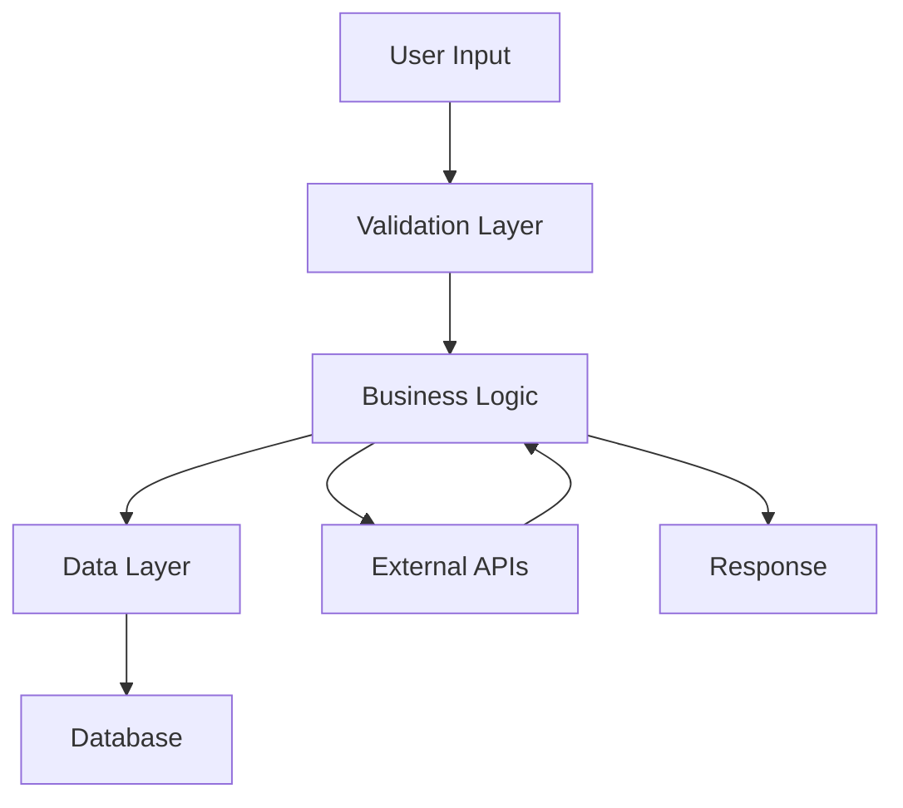

# {{FEATURE_NAME}}

## Summary

Brief overview of the {{FEATURE_NAME}} feature and its purpose.

## Current Status

- ✅ Implemented: What's been completed
- 🚧 In Progress: What's currently being worked on
- ❌ Not Implemented: What's planned for future implementation

### Visual Progress
```
Component A         [██████████] 100% Complete ✅
Component B         [████████░░] 80% In Progress 🚧
Component C         [░░░░░░░░░░] 0% Not Started ❌
━━━━━━━━━━━━━━━━━━━━━━━━━━━━━━━━━━━━━━━━━━━━━━
Overall             [██████░░░░] 60%
```

## Requirements

### Functional Requirements
- Requirement 1: Description and acceptance criteria
- Requirement 2: Description and acceptance criteria
- Requirement 3: Description and acceptance criteria

### Non-Functional Requirements
- Performance: Expected performance characteristics
- Security: Security requirements and considerations
- Accessibility: WCAG compliance requirements
- Scalability: Expected load and growth requirements

## Technical Details

### Architecture Overview



### Implementation Approach

1. **Phase 1**: Core functionality implementation
2. **Phase 2**: Integration with existing systems
3. **Phase 3**: Performance optimization and testing
4. **Phase 4**: Documentation and deployment

### Key Components

#### Component 1: {{COMPONENT_NAME_1}}
- **Purpose**: What this component does
- **Input**: Expected input format and validation
- **Output**: Expected output format
- **Dependencies**: Other components or services it depends on

#### Component 2: {{COMPONENT_NAME_2}}
- **Purpose**: What this component does
- **Input**: Expected input format and validation
- **Output**: Expected output format
- **Dependencies**: Other components or services it depends on

### Data Models

```typescript
interface {{FEATURE_NAME}}Data {
  id: string;
  name: string;
  status: 'active' | 'inactive' | 'pending';
  createdAt: Date;
  updatedAt: Date;
}

interface {{FEATURE_NAME}}Config {
  enabled: boolean;
  options: {
    // Configuration options
  };
}
```

### API Endpoints

```typescript
// Get feature data
GET /api/{{API_ENDPOINT}}

// Create new feature item
POST /api/{{API_ENDPOINT}}

// Update existing feature item
PUT /api/{{API_ENDPOINT}}/:id

// Delete feature item
DELETE /api/{{API_ENDPOINT}}/:id
```

## Testing Strategy

### Test Coverage Requirements
- Unit Tests: Target 90%+ coverage
- Integration Tests: All API endpoints and major workflows
- End-to-End Tests: Critical user journeys

### Test Cases

#### Unit Tests
- [ ] Component rendering and props handling
- [ ] Business logic validation
- [ ] Error handling scenarios
- [ ] Edge cases and boundary conditions

#### Integration Tests
- [ ] API endpoint functionality
- [ ] Database operations
- [ ] External service integrations
- [ ] Authentication and authorization

#### End-to-End Tests
- [ ] Complete user workflow
- [ ] Cross-browser compatibility
- [ ] Performance under load
- [ ] Accessibility compliance

### Test Data
- Use factories and fixtures for consistent test data
- Separate test database from development
- Clean up test data after each test run

## Security Considerations

### Security Requirements
- [ ] Input validation and sanitization
- [ ] Authentication and authorization
- [ ] Data encryption at rest and in transit
- [ ] Audit logging for sensitive operations

### Threat Model
- **Threat 1**: Description and mitigation strategy
- **Threat 2**: Description and mitigation strategy
- **Threat 3**: Description and mitigation strategy

## Performance Requirements

### Performance Targets
- Response Time: < 200ms for standard operations
- Throughput: Support for X concurrent users
- Resource Usage: Memory and CPU constraints
- Scalability: Ability to handle Y% growth

### Optimization Strategies
- Caching strategy for frequently accessed data
- Database query optimization
- API response optimization
- Frontend bundle size optimization

## Dependencies

### Internal Dependencies
- Component/Service 1: What functionality is needed
- Component/Service 2: What functionality is needed

### External Dependencies
- External API 1: Integration requirements
- Third-party library 1: Version and usage
- Third-party service 1: Service level requirements

## Configuration

### Environment Variables
```bash
# Feature toggle
{{FEATURE_NAME}}_ENABLED=true

# Feature-specific configuration
{{FEATURE_NAME}}_API_ENDPOINT=https://api.example.com
{{FEATURE_NAME}}_TIMEOUT=5000
```

### Feature Flags
- `enable{{FEATURE_NAME}}`: Master toggle for the entire feature
- `{{FEATURE_NAME}}AdvancedMode`: Enable advanced functionality
- `{{FEATURE_NAME}}Beta`: Enable beta features

## Deployment

### Deployment Strategy
1. Feature flag deployment (disabled by default)
2. Gradual rollout to percentage of users
3. Monitor metrics and error rates
4. Full rollout after validation

### Rollback Plan
- Disable feature flag if issues are detected
- Database migration rollback procedures
- Communication plan for affected users

## Monitoring and Analytics

### Key Metrics
- Usage metrics: User adoption and engagement
- Performance metrics: Response times and error rates
- Business metrics: Conversion rates and user satisfaction

### Alerts and Monitoring
- Error rate > 1%
- Response time > 500ms
- User adoption < expected baseline

## Documentation

### User Documentation
- [ ] User guide with screenshots
- [ ] API documentation
- [ ] Troubleshooting guide
- [ ] FAQ section

### Developer Documentation
- [ ] Setup and configuration guide
- [ ] Code architecture overview
- [ ] Testing guide
- [ ] Deployment procedures

## Future Enhancements

### Planned Improvements
- Enhancement 1: Description and timeline
- Enhancement 2: Description and timeline
- Enhancement 3: Description and timeline

### Known Limitations
- Limitation 1: Description and potential workaround
- Limitation 2: Description and potential workaround

## Related Documentation

- [Architecture Overview](../architecture.md)
- [API Documentation](../api/{{API_NAME}}.md)
- [Testing Guide](../testing/{{FEATURE_NAME}}-testing.md)

---

*Last reviewed: {{LAST_UPDATED}}*