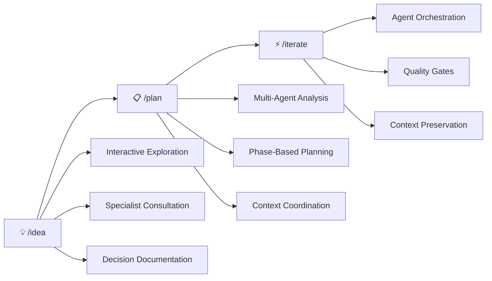

# AI Coding Template

## Transform AI into Your Architectural Partner

From simple code generator to intelligent development partner through the **revolutionary /idea → /plan → /iterate workflow**.

### The Problem: AI Coding Without Context

Traditional AI coding is reactive and forgetful:
- ❌ Generate code without understanding the bigger picture
- ❌ Lose context between long development sessions
- ❌ Make architectural decisions in isolation
- ❌ Create inconsistent patterns and duplicate functionality

### The Solution: The Core Workflow

**THIS CHANGES EVERYTHING**



#### 1. 💡 `/idea` - Interactive Architectural Exploration
Transform architectural decision-making from guesswork to guided exploration:
- **Conversational AI Facilitation**: AI guides you through structured decision exploration
- **On-Demand Expert Consultation**: Specialist agents provide domain insights during conversation
- **Comprehensive Documentation**: Automatic ADR generation with full context and rationale

#### 2. 📋 `/plan` - Sequential Multi-Agent Planning
Turn vague requirements into detailed, expertly-reviewed implementation plans:
- **Intelligent Agent Selection**: Automatically selects domain experts based on issue content
- **Sequential Context Building**: Each agent builds on previous analysis for comprehensive understanding
- **Phase-Based Task Generation**: Creates P1.X.X → P2.X.X → P3.X.X tasks with quality gates

#### 3. ⚡ `/iterate` - Orchestrated Task Execution
Execute plans with perfect context preservation and quality validation:
- **Context-Aware Execution**: Every agent receives complete context from previous work
- **Automatic Quality Gates**: Built-in validation prevents progression without passing standards
- **Coordination File Management**: HANDOFF.yml and RESEARCH.md maintain perfect context

### Why This Workflow Matters

**🎯 Architectural Quality**: Decisions are thoroughly explored before any code is written
**🧠 Perfect Memory**: Context is preserved across sessions, agents, and phases
**👥 Multi-Expert Coordination**: 17 specialized agents work together seamlessly
**⚡ Quality Assurance**: Built-in gates ensure standards are maintained throughout
**📈 Scalable Complexity**: Works for simple features to complex system redesigns

## The Complete Workflow in Action

### Real-World Example: Adding Authentication

```bash
# 1. EXPLORE THE DECISION
/idea --start "How should we implement user authentication?"
# → 20-minute guided conversation with security expert consultation
# → Explores OAuth vs JWT vs hybrid approaches
# → Generates comprehensive ADR with decision rationale

# 2. PLAN THE IMPLEMENTATION
/plan --issue AUTH-123
# → 8-minute sequential analysis by 5 expert agents
# → Generates 15 tasks across 3 phases with technical specifications
# → Complete context in RESEARCH.md and HANDOFF.yml

# 3. EXECUTE WITH QUALITY
/iterate  # Automatically starts P1.1.0
# → Executes each task with appropriate specialist agent
# → Quality gates between every task
# → Context preserved throughout all 15 tasks
# → Ready for deployment with full documentation
```

**Result**: From idea to production-ready feature with expert-level architecture, comprehensive planning, and quality execution.

## Quick Start: Your First Workflow (5 Minutes)

### Prerequisites

- Git (2.25+)
- VS Code or preferred editor
- AI assistant account (Claude Code, Claude, etc.)

### 1. Setup the Template

```bash
# Clone the template
git clone https://github.com/yourusername/ai-coding-template.git my-project
cd my-project

# Quick setup
./scripts/setup-manager.sh quick

# Verify installation
./scripts/ai-status.sh --check
```

### 2. Experience the Workflow

**Try the complete workflow with a simple feature:**

```bash
# EXPLORE: Start with an architectural decision
/idea --start "How should we structure user data validation?"

# PLAN: Create implementation plan
/plan --issue VALIDATION-001

# EXECUTE: Run through the tasks
/iterate
```

**This 15-minute experience will show you:**
- How AI-guided exploration improves decisions
- How multi-agent planning creates better implementations
- How context preservation eliminates the "forgetting" problem

### 3. Learn the System

**→ [Workflow Deep Dive](./docs/ai-tools/guides/workflow-guide.md)** - Master the three phases
**→ [Agent System](./docs/ai-tools/guides/using-agents.md)** - Understand your 17 specialists
**→ [Complete Setup](./docs/ai-tools/setup/quick-start.md)** - Full configuration options

## How the Template Supports the Workflow

### Workflow-Optimized Project Structure

```
my-project/
├── .claude/                    # Workflow Orchestration System
│   ├── commands/               # /idea, /plan, /iterate implementations
│   └── agents/                # 17 specialized experts for each workflow phase
├── deliverables/              # /plan Output: Organized implementation tracking
│   └── [feature]/issues/      # PLAN.md, HANDOFF.yml, RESEARCH.md per issue
├── docs/                      # Workflow Documentation Integration
│   ├── technical/decisions/   # /idea Output: ADRs and exploration sessions
│   ├── technical/architecture/ # Auto-generated from implementations
│   └── ai-tools/              # Workflow guides and references
├── scripts/                   # Workflow Automation Support
│   ├── docs-manager.sh        # ADR generation, auto-documentation
│   └── quality-gates.sh       # /iterate quality validation
├── CLAUDE.md                  # AI instructions centered on workflow
└── STATUS.md                  # Cross-session context preservation
```

### The 17-Agent System: Your Expert Council

Agents are automatically selected and orchestrated throughout the workflow:

**Foundation Agents** (Always involved):
- **context-analyzer**: Understands codebase patterns and integration points
- **code-architect**: Makes architectural decisions and ensures system coherence
- **project-manager**: Generates comprehensive plans and coordinates phases

**Domain Specialists** (Content-based selection):
- **frontend-specialist**, **backend-specialist**: Implementation expertise
- **database-specialist**: Data architecture and schema design
- **api-designer**: Service contracts and integration patterns
- **security-auditor**: Security analysis and vulnerability assessment
- **performance-optimizer**: Performance analysis and optimization strategies

**Quality Specialists** (Cross-cutting):
- **test-engineer**: Testing strategy and comprehensive quality validation
- **code-reviewer**: Code quality, standards compliance, and architectural consistency
- **docs-sync-agent**: Documentation maintenance and automatic generation

[Complete Agent Reference →](./docs/ai-tools/guides/using-agents.md)

### Workflow Automation Infrastructure

Everything is designed to enhance the core workflow:

**Command System**:
- `/idea` - Interactive architectural exploration with specialist consultation
- `/plan` - Sequential multi-agent planning with intelligent agent selection
- `/iterate` - Orchestrated task execution with quality gates

**Context Management**:
- `HANDOFF.yml` - Perfect agent-to-agent context passing
- `RESEARCH.md` - Accumulated knowledge from all workflow phases
- `STATUS.md` - Cross-session workflow state preservation

**Quality Assurance**:
- Automatic quality gates between workflow phases
- Built-in validation preventing progression without standards
- Smart recovery and remediation suggestions

**Documentation Integration**:
- ADR generation from `/idea` architectural exploration
- Technical decision tracking linked to implementation
- Auto-generated architecture docs from `/iterate` execution

## Master the Workflow

### 📚 Workflow Guides

- **[Workflow Deep Dive](./docs/ai-tools/guides/workflow-guide.md)** - Complete guide to /idea → /plan → /iterate
- **[Using the Agent System](./docs/ai-tools/guides/using-agents.md)** - How 17 specialists enhance each phase
- **[Architectural Exploration](./docs/ai-tools/guides/idea-guide.md)** - Master the /idea command for better decisions

### 🔧 Implementation Resources

- **[Commands Reference](./docs/ai-tools/reference/commands.md)** - Complete command documentation
- **[Integration Guide](./docs/ai-tools/setup/integration-guide.md)** - Add workflow to existing projects
- **[Troubleshooting](./docs/ai-tools/reference/troubleshooting.md)** - Solve workflow and agent issues

### 🎯 Quick References

- **[Quality Gates Guide](./docs/ai-tools/reference/quality-gates.md)** - Understand validation between phases
- **[Context Management](./docs/ai-tools/guides/ai-collaboration-guide.md)** - Perfect context preservation
- **[Team Collaboration](./docs/development/workflows/team-workflow.md)** - Scale the workflow across teams

## Add Workflow to Existing Projects

Already have a project? The workflow can be integrated progressively:

### Option 1: Workflow-Only Integration (15 mins)

```bash
# Add just the core workflow system
curl -O [template-url]/workflow-core.tar.gz
tar -xzf workflow-core.tar.gz

# Test the workflow immediately
/idea --start "How should we improve our current architecture?"
```

### Option 2: Progressive Integration (1 week)

**Day 1-2**: Add workflow commands (`/idea`, `/plan`, `/iterate`)
**Day 3-4**: Integrate agent system for specialist consultation
**Day 5-7**: Add full automation and quality gates

### Option 3: Complete Template Integration

Transform your entire development process with the full template:
**[Complete Integration Guide →](./docs/ai-tools/setup/integration-guide.md)**

## Why Teams Choose This Workflow

### Before: Traditional AI Coding

```bash
# Ask AI for code
"Write a user authentication system"

# Get code without context
# ❌ No architectural exploration
# ❌ No expert consultation
# ❌ No quality gates
# ❌ Context lost between sessions
```

### After: Workflow-Driven Development

```bash
# Explore the decision thoroughly
/idea --start "How should we implement authentication?"
# → Guided conversation with security expert
# → Comprehensive ADR with rationale

# Plan with expert analysis
/plan --issue AUTH-123
# → 5 specialists analyze and plan
# → 15 tasks with quality gates

# Execute with perfect context
/iterate
# → Context preserved across all tasks
# → Quality validation at every step
```

**Result**: Expert-level architecture, comprehensive planning, and quality execution.

## Contributing to the Workflow

Help improve the /idea → /plan → /iterate workflow for everyone:

### Workflow Improvements

- 🎯 **Enhance Commands**: Improve `/idea`, `/plan`, or `/iterate` functionality
- 🤖 **Agent Optimization**: Make agents more effective at their specializations
- 📋 **Planning Templates**: Create better task generation patterns
- 🔍 **Quality Gates**: Add validation that prevents common issues

### Community

- 🐛 [Report Workflow Issues](https://github.com/yourusername/ai-coding-template/issues)
- 💡 [Suggest Workflow Enhancements](https://github.com/yourusername/ai-coding-template/discussions)
- 🤝 [Submit Workflow Improvements](https://github.com/yourusername/ai-coding-template/pulls)

**[Contribution Guidelines →](./docs/development/guidelines/contributing.md)**

## Success Stories & Community

### Learn from Others

- 📖 **[Workflow Success Stories](https://example.com/success-stories)** - How teams transformed their development
- 🎥 **[Workflow Demo Videos](https://example.com/demos)** - See the complete /idea → /plan → /iterate flow
- 📚 **[Best Practices Guide](https://example.com/best-practices)** - Patterns from successful implementations

### Join the Community

- 💬 **[Discord Community](https://discord.gg/example)** - Discuss workflow optimizations
- 🌟 **[Star on GitHub](https://github.com/yourusername/ai-coding-template)** - Support the project
- 📧 **[Newsletter](https://example.com/newsletter)** - Workflow tips and updates

## Get Started Today

**Ready to transform AI from code generator to architectural partner?**

```bash
# Experience the workflow in 15 minutes
git clone https://github.com/yourusername/ai-coding-template.git
cd ai-coding-template
./scripts/setup-manager.sh quick

# Try your first workflow
/idea --start "How should we structure our project architecture?"
```

**[Complete Setup Guide →](#quick-start-your-first-workflow-5-minutes)**

---

## Resources & Inspiration

### Methodology References

- [C4 Model](https://c4model.com) - Architectural documentation approach
- [12Factor](https://12factor.net) - Application design principles
- [ADR Process](https://adr.github.io/) - Architecture Decision Records

### Related Projects

- [GitHub Spec Kit](https://github.com/github/spec-kit) - Specification-driven development
- [AB Method](https://github.com/ayoubben18/ab-method) - Alternative AI development approach
- [GitHub: Spec Driven Development](https://github.blog/ai-and-ml/generative-ai/spec-driven-development-with-ai-get-started-with-a-new-open-source-toolkit/) - AI-powered specification development

---

Built with ❤️ by developers who believe AI should be an architectural partner, not just a code generator.

**Transform your development workflow today.**
