# AI Coding Template

## Intro

This is an attempt to add structure and guidance around ai-assisted coding. It is very much in an alpha phase at the moment and I greatly appreciate any feedback on it. This is an experiment, I'm still figuring out the best way to give the AI tools all of the context and guide rails they need to work effectively without being too restrictive or trying to basically replicated Jira in your repo.

**Project Structure**: This template includes both the AI workflow framework (in the root) and example application code (in `src/`) that is being used to test this out and try out different commands, workflows and iterations.

## Transform AI into Your Architectural Partner

From simple code generator to intelligent development partner through the streamlined 4-phase epic-driven /design → /architect → /plan → /develop workflow.

---

## 🚀 **New Here? Start Smart**

### **🎯 Choose Your Entry Point**

- **[👋 START HERE](./START-HERE.md)** - New user? Your 5-minute guided introduction
- **[🤖 AI Workflow Commands](./docs/ai-tools/reference/commands.md)** - Let AI handle everything automatically
- **[⚡ 2-Minute Demo](#quick-demo)** - See the value immediately

### **📚 Essential Navigation**

- **[🔧 All Commands](./docs/ai-tools/reference/commands.md)** - Complete command reference
- **[🤖 17 Specialist Agents](./docs/ai-tools/guides/comprehensive-agent-guide.md)** - Your expert team
- **[🏗️ Complete Setup](./docs/ai-tools/setup/quick-start.md)** - Full configuration guide
- **[📋 AI Collaboration Guide](./docs/ai-tools/guides/ai-collaboration-guide.md)** - Epic workflow patterns and best practices

### **🚀 Getting Started**

1. **[👋 START HERE](./START-HERE.md)** - 5-minute guided introduction
2. **[⚡ Quick Demo](#quick-demo)** - See the workflow in action
3. **[🏗️ Setup Guide](./docs/ai-tools/setup/quick-start.md)** - Complete configuration
4. **[🤖 Agent System](./docs/ai-tools/guides/comprehensive-agent-guide.md)** - 17 specialist team
5. **[🤖 AI Commands](./docs/ai-tools/reference/commands.md)** - Start your AI-assisted workflow

---

## 🤔 Why This Matters: The AI Coding Problem

**Traditional AI development suffers from critical issues:**

- ❌ **Context Amnesia**: AI forgets decisions and repeats questions
- ❌ **Architectural Blindness**: No understanding of how pieces fit together
- ❌ **Pattern Inconsistency**: Each request generates different approaches
- ❌ **Quality Gaps**: No systematic validation between iterations

**Result**: Hours of repetitive explanations and inconsistent architectural decisions.

### **The Solution: AI as Architectural Partner**

**Transform AI from reactive code generator to proactive architectural partner:**

```mermaid
graph LR
    D[📝 /design] --> A[🏗️ /architect] --> P[📋 /plan] --> V[⚡ /develop]

    D --> D1[Vision & Strategy]
    D --> D2[Feature Requirements]
    D --> D3[User Stories]

    A --> A1[Technology Stack]
    A --> A2[Architecture Decisions]
    A --> A3[Implementation Patterns]

    P --> P1[Multi-Agent Analysis]
    P --> P2[Task Breakdown]
    P --> P3[Context Coordination]

    V --> V1[Agent Orchestration]
    V --> V2[Quality Gates]
    V --> V3[Context Preservation]
```



#### 1. 📝 `/design` - Vision, Epics, and Requirements

Define all non-technical aspects - from project vision to epic-driven development structure:

- **Vision Documents**: Project purpose, goals, and success metrics
- **Epic Structure**: Organized development units with clear scope and business context
- **User Stories**: Individual TASK files with user workflows and acceptance criteria
- **Business Context**: Problem statements, target audience, and value propositions
- **Test Scenarios**: BDD-style Given-When-Then scenarios derived from requirements

#### 2. 🏗️ `/architect` - Technical Architecture and Infrastructure (Quick Mode: 5-10 min, Deep Mode: 20+ min)

Make comprehensive technical decisions through optimized collaborative exploration:

- **Quick Mode (Default)**: Standard architectural decisions with Fast Track ADRs (90% of cases)
- **Deep Mode (--deep)**: Complex decisions with comprehensive analysis (10% of cases)
- **3-Tier Agent System**: Streamlined consultation (Always/Context-based/On-demand agents)
- **Direct Questions**: `/architect "NextJS or React for this?"` for immediate guidance
- **Decision Documentation**: Automatic ADR generation with appropriate detail level

#### 3. 📋 `/plan` - Epic-Driven Implementation Planning

Break down architecture into executable tasks with epic structure and progressive discovery:

- **Epic Structure**: Creates `epics/[name]/EPIC.md` with task directories and `resources/`
- **Progressive Task Discovery**: Tasks numbered by discovery order (X.Y.Z format) across all workflow phases
- **X.Y.Z Implementation**: Task directories with TASK.md, HANDOFF.yml, RESEARCH.md
- **Testing Integration**: Dedicated testing tasks with 95%+ coverage requirements and BDD scenarios
- **Agent Selection**: Intelligent assignment based on task requirements with agent hints

#### 4. ⚡ `/develop` - Streamlined Development Execution (Optimized from 253 to 78 lines)

Execute implementation tasks with test-first enforcement and epic integration:

- **Test-First Enforcement**: Auto-invoked test-engineer with TDD/BDD approach
- **4-Step Execution Flow**: Test validation → Task execution → Quality integration → Progress tracking
- **Epic Branch Management**: Hierarchical branching with `epic/[name]` containing `task/###-[name]`
- **X.Y.Z Implementation**: Precise task referencing with progressive discovery support
- **Comprehensive Testing Integration**: Hybrid TDD/BDD strategy with 95%+ coverage targets

### Why This Workflow Matters

**🎯 Architectural Quality**: Decisions are thoroughly explored before any code is written **🧠 Perfect Memory**: Context is preserved across sessions, agents, and phases **👥 Multi-Expert Coordination**: 17 specialized agents work together seamlessly **⚡ Quality Assurance**: Built-in gates ensure standards are maintained throughout **📈 Scalable Complexity**: Works for simple features to complex system redesigns

### Key Innovation: Agent-First Architecture

**🚀 Intelligence Over Automation**: Scripts serve agents, not users directly

- Agents make context-aware decisions about which scripts to invoke
- Intelligent orchestration replaces manual script coordination
- Scripts become tools that agents use intelligently

**🔗 Unified Interface**: Complex operations simplified through intelligent commands

- `/docs` replaces 5+ manual documentation scripts
- `/quality` coordinates multiple validation tools automatically
- `/status` provides intelligent analysis, not just raw data

**🧠 Context-Aware Execution**: Every script invocation includes project context

- Agents understand project state and requirements
- Scripts receive relevant context for optimal execution
- Results are interpreted and integrated intelligently

## Quick Demo

**See the value in 2 minutes before diving deeper:**

```bash
# Clone and run the interactive demo
git clone [your-repo] my-project && cd my-project
npm run demo
```

This simulation shows you exactly how the template transforms AI from reactive coding to proactive architectural partnership.

## 🔄 **Intelligent Project Setup**

**AI-powered initialization** that understands your project type, business context, and team needs:

```bash
git clone ai-coding-template.git my-project
cd my-project
./.resources/scripts/setup-manager.sh init-project
```

- **Smart Discovery**: Automatically detects project type and business context
- **Tool Integration**: Connects with Jira, Linear, Confluence, Notion
- **Custom Configuration**: Generates tailored README and AI instructions

**[Complete Setup Guide →](./docs/ai-tools/setup/quick-start.md)**

## Quick Start: Your First Workflow (5 Minutes)

### Prerequisites

**Required:**

- Git (2.25+)
- VS Code or preferred editor
- AI assistant account (Claude Code, Claude, etc.)
- **[uv](https://github.com/astral-sh/uv)** - Python package manager for semantic code analysis

  ```bash
  # Install uv (required for Serena semantic tools)
  curl -LsSf https://astral.sh/uv/install.sh | sh
  ```

**Optional (Enhanced Multi-Model Intelligence):**

- **[Gemini CLI](https://github.com/google-gemini/gemini-cli)** - Enables cross-validation and second opinions from Google's Gemini

  ```bash
  # Install via npm
  npm install -g @google/gemini-cli

  # Or using your package manager
  # See: https://github.com/google-gemini/gemini-cli#installation
  ```

### 1. Intelligent Project Setup

```bash
# Clone the template
git clone https://github.com/yourusername/ai-coding-template.git my-project
cd my-project

# 🚀 INTELLIGENT INITIALIZATION (Recommended for new projects)
./.resources/scripts/setup-manager.sh init-project
# → Guided setup: project type, business context, external tools
# → Professional README generation
# → Template docs preserved in docs/ai-tools/

# OR: Quick setup (keeps template as-is)
./.resources/scripts/setup-manager.sh quick

# Verify everything is ready
./.resources/scripts/setup-manager.sh check
```

**🎯 What `init-project` does:**

1. **Verifies Claude Code** is installed and ready
2. **Discovers your project** through guided questions
3. **Integrates external tools** (Jira, Confluence, etc.)
4. **Generates professional docs** tailored to your project type
5. **Preserves template knowledge** in `docs/ai-tools/`

### 2. Experience the Workflow

**Try the complete epic-driven workflow:**

```bash
# DESIGN: Define vision, features, and requirements
/design --epic "user-data-validation"

# ARCHITECT: Quick Mode architectural decisions
/architect data-validation

# PLAN: Create epic structure with task discovery
/plan --issue VALIDATION-001

# DEVELOP: Execute tasks with test-first approach
/develop
```

**This 15-minute experience will show you:**

- How AI-guided exploration improves decisions
- How multi-agent planning creates better implementations
- How context preservation eliminates the "forgetting" problem

### 3. Learn the System

**→ [Commands Reference](./docs/ai-tools/reference/commands.md)** - Master the four phases **→ [Agent System](./docs/ai-tools/guides/comprehensive-agent-guide.md)** - Understand your 17 specialists **→ [AI Collaboration Guide](./docs/ai-tools/guides/ai-collaboration-guide.md)** - Advanced AI patterns **→ [Complete Setup](./docs/ai-tools/setup/quick-start.md)** - Full configuration options

## How the Template Supports the Workflow

### Workflow-Optimized Project Structure

```text
my-project/
├── .claude/                    # Workflow Orchestration System
│   ├── commands/               # /design, /architect, /plan, /develop implementations
│   ├── agents/                 # 17 specialized experts for each workflow phase
│   └── metrics/                # Usage analytics and performance tracking
│       ├── config.yml          # Metrics collection configuration
│       ├── schema.json         # Data validation schema
│       ├── commands.jsonl      # Command execution metrics
│       ├── agents.jsonl        # Agent performance metrics
│       └── scripts.jsonl       # Script automation metrics
├── epics/                     # /plan Output: Epic-driven task organization
│   └── [name]/                # Epic directory with EPIC.md and task directories
│       ├── EPIC.md            # Epic overview and task tracking
│       ├── TASK-001/          # Individual task directories
│       │   ├── TASK.md        # X.Y.Z task implementation details
│       │   ├── HANDOFF.yml    # Agent-to-agent context passing
│       │   └── RESEARCH.md    # Accumulated knowledge
│       └── resources/         # Epic-specific resources and templates
├── docs/                      # Workflow Documentation Integration
│   ├── technical/decisions/   # /architect Output: ADRs and technical decisions
│   ├── technical/architecture/ # Auto-generated from implementations
│   └── ai-tools/              # Workflow guides and references
├── .resources/scripts/                   # Workflow Automation Support
│   ├── docs-manager.sh        # ADR generation, auto-documentation
│   ├── quality-gates.sh       # /develop quality validation
│   └── metrics/               # Analytics and insights tools
│       ├── generate-report.sh # Usage analytics and insights
│       ├── query-metrics.sh   # Data exploration and filtering
│       └── README.md          # Complete metrics documentation
├── CLAUDE.md                  # AI instructions centered on workflow
└── STATUS.md                  # Cross-session context preservation
```

### 17 AI Specialist Agents

Expert AI agents automatically coordinate throughout the workflow:

- **Foundation**: context-analyzer, code-architect, project-manager
- **Development**: frontend-specialist, backend-specialist, database-specialist, api-designer
- **Quality**: test-engineer, code-reviewer, security-auditor, performance-optimizer
- **Operations**: devops-engineer, technical-writer, migration-specialist, refactoring-specialist, data-analyst, technical-writer

**[Complete Agent Guide →](./docs/ai-tools/guides/comprehensive-agent-guide.md)**

### Workflow Automation Infrastructure

Everything is designed to enhance the core workflow:

**Intelligent Command System**:

- `/design` - Vision, features, and requirements definition
- `/architect` - Technical architecture design with Quick/Deep Mode
- `/plan` - Sequential multi-agent planning with epic structure
- `/develop` - Orchestrated task execution with test-first enforcement
- `/docs` - Unified documentation coordination (replaces manual script usage)
- `/quality` - Comprehensive quality assessment with multi-agent script orchestration
- `/status` - Enhanced project intelligence (powered by `context-analyzer` + `ai-status.sh`)

### Available Commands

The template provides **11 intelligently integrated commands** that orchestrate agents and scripts seamlessly:

**🌟 Core Workflow Commands:**

- **`/design`** - Vision, features, and requirements definition
- **`/architect`** - Technical architecture design with Quick/Deep Mode optimization
- **`/plan`** - Sequential multi-agent planning with epic structure and X.Y.Z task numbering
- **`/develop`** - Orchestrated task execution with test-first enforcement and epic integration

**🔧 Unified Intelligence Commands:**

- **`/docs`** - Unified documentation management with intelligent agent coordination
- **`/quality`** - Comprehensive quality assessment with multi-agent coordination
- **`/status`** - Enhanced project status with intelligent context analysis

**📋 Development Support Commands:**

- **`/commit`** - Git commit with quality checks and conventional messages
- **`/review`** - Comprehensive code review with multi-dimensional analysis
- **`/security-audit`** - OWASP-compliant security assessment with remediation
- **`/test-fix`** - Automatic test failure detection, analysis, and resolution
- **`/merge-branch`** - Safe branch merging with deployment validation

**Enhanced Workflow Examples:**

```bash
# Quality-focused development with epic-driven workflow
/design --feature "Secure File Uploads"
/architect secure-uploads
/plan --issue UPLOAD-123
/develop                          # Execute core tasks with test-first enforcement
/quality audit --focus security   # Multi-agent security assessment
/docs sync                        # Intelligent documentation updates
/commit                          # Quality commit

# Daily development workflow with epic integration
/status --ai-format              # Intelligent context analysis
/quality validate --scope current-phase  # Automated quality gates
/docs validate                   # Documentation health check
/develop                         # Continue current epic task
```

**→ [Complete Commands Reference](./docs/ai-tools/reference/commands.md)** - Detailed usage guide for all integrated commands

**Context Management**:

- `HANDOFF.yml` - Perfect agent-to-agent context passing
- `RESEARCH.md` - Accumulated knowledge from all workflow phases
- `STATUS.md` - Cross-session workflow state preservation

**Quality Assurance**:

- Automatic quality gates between workflow phases
- Built-in validation preventing progression without standards
- Smart recovery and remediation suggestions

**Documentation Integration**:

- ADR generation from `/architect` technical design
- Technical decision tracking linked to implementation
- Auto-generated architecture docs from `/develop` execution
- **Automatic documentation**: Run `./.resources/scripts/docs-manager.sh auto-docs all` to generate:
  - Technology stack documentation
  - System overview diagrams
  - Dependency graphs
  - Architecture documentation

## Development Scripts

Essential scripts for workflow automation:

- **Setup**: `./.resources/scripts/setup-manager.sh quick` - Environment setup
- **Documentation**: `./.resources/scripts/docs-manager.sh auto-docs all` - Generate documentation
- **Status**: `./.resources/scripts/ai-status.sh` - Project health dashboard
- **Quality**: `./.resources/scripts/validate-quality-gates.sh` - Validate between phases
- **Metrics**: `./.resources/scripts/metrics/generate-report.sh` - Analytics and insights

**[Complete Scripts Reference →](./.resources/scripts/README.md)**

## 📊 Metrics & Analytics System

**Transform usage patterns into actionable insights** for continuous workflow optimization.

### What Gets Measured

The comprehensive metrics system automatically tracks:

- **🎯 Command Effectiveness**: Success rates, execution patterns, workflow progression for `/design`, `/architect`, `/plan`, `/develop`
- **🤖 Agent Performance**: Utilization patterns, task completion rates, model usage for all 17 specialized agents
- **⚙️ Script Automation**: Execution frequency, resource usage, integration patterns for all workflow scripts
- **📈 Workflow Analytics**: Cross-phase dependencies, bottleneck identification, optimization opportunities

### Quick Metrics Start

```bash
# Enable metrics (enabled by default)
# Configuration: .claude/metrics/config.yml

# Generate weekly insights report
./.resources/scripts/metrics/generate-report.sh --period 7d --type summary

# Query specific patterns
./.resources/scripts/metrics/query-metrics.sh --type command --range 30d --stats

# Analyze agent effectiveness
./.resources/scripts/metrics/query-metrics.sh --type agent --stats --format json
```

### Actionable Insights

**📊 Workflow Optimization**: Identify which commands and agents provide the most value
**🎯 Performance Monitoring**: Track execution times, success rates, and resource utilization
**🔍 Bottleneck Detection**: Discover workflow phases that need optimization
**📈 Decision Support**: Data-driven insights for tool and process improvements

### Privacy & Security

- **🛡️ Local Storage**: All data stays on your machine
- **🔒 No Code Content**: Only metadata and performance metrics collected
- **⚙️ Configurable Collection**: Adjust data collection levels and exclusions
- **📋 JSONL Format**: Structured, queryable data for custom analysis

**[Complete Metrics Guide →](./.resources/scripts/metrics/README.md)**

## Add to Existing Projects

Integrate the workflow progressively into your existing codebase:

```bash
# Quick integration
curl -O [template-url]/workflow-integration.tar.gz && tar -xzf workflow-integration.tar.gz
```

**[Complete Integration Guide →](./docs/ai-tools/setup/integration-guide.md)**

## Why Teams Choose This Intelligent Integration

### Before: Manual Script Management

```bash
# Manual script coordination
"Run ./.resources/scripts/docs-manager.sh auto-docs all"
"Run ./.resources/scripts/validate-quality-gates.sh"
"Run ./.resources/scripts/check-docs-links.js"

# ❌ No intelligent coordination
# ❌ Manual script selection
# ❌ No context-aware execution
# ❌ Fragmented workflow
```

### After: Intelligent Agent-Script Integration

```bash
# Unified intelligent commands
/docs generate --type all
# → technical-writer coordinates auto-docs-generator.js
# → Intelligent content creation with codebase analysis

/quality assess --depth deep
# → Multi-agent coordination (code-reviewer, security-auditor, test-engineer)
# → Automatic script orchestration based on context

/status --detailed
# → context-analyzer processes ai-status.sh output
# → Intelligent insights and recommendations
```

**Result**: Intelligent script orchestration, context-aware execution, and unified workflow integration.

## 📚 Templates & Examples System

### Accelerate Development with Standardized Resources

The template system provides **fill-in-the-blank starting points** and **working reference implementations** to accelerate your development:

**🔍 Quick Discovery**:

- **Need to create a feature?** → [Feature Templates](./.resources/templates/docs/features/)
- **Building a React component?** → [Component Template](./.resources/templates/code/components/) + [Component Example](./.resources/examples/code/patterns/)
- **Creating an API service?** → [Service Template](./.resources/templates/code/api/) + [Service Example](./.resources/examples/code/patterns/)
- **Writing tests?** → [Test Examples](./.resources/examples/code/patterns/)
- **Documenting an API?** → [API Template](./.resources/templates/docs/api/)

**📋 Two Resource Types**:

- **Templates** (`/.resources/templates/`) - Fill-in-the-blank starting points with placeholders
- **Examples** (`/.resources/examples/`) - Working reference implementations to study and adapt

**🚀 Get Started**:

```bash
# Start the AI workflow - no templates needed
/design --epic "your-epic-name"

# Copy a template to start fresh
cp .resources/templates/docs/features/feature.template.md docs/my-feature.md

# Study working examples for patterns
cat .resources/examples/code/patterns/api-user-service.example.ts
```

**[📖 Complete AI Workflow Guide →](./docs/ai-tools/reference/commands.md)**

## Contributing to the Workflow

Help improve the /design → /architect → /plan → /develop workflow for everyone:

### Workflow Improvements

- 🎯 **Enhance Commands**: Improve `/design`, `/architect`, `/plan`, or `/develop` functionality
- 🤖 **Agent Optimization**: Make agents more effective at their specializations
- 📋 **Planning Templates**: Create better task generation patterns
- 🔍 **Quality Gates**: Add validation that prevents common issues

### Community

**[Issues](https://github.com/yourusername/ai-coding-template/issues)** • **[Discussions](https://github.com/yourusername/ai-coding-template/discussions)** • **[Contributing](./docs/development/guidelines/contributing.md)**

---

## References

**Methodologies**: [C4 Model](https://c4model.com) • [12Factor](https://12factor.net) • [ADR Process](https://adr.github.io/)

**Related Projects**: [AB Method](https://github.com/ayoubben18/ab-method) • [GitHub Spec Kit](https://github.com/github/spec-kit) • [Claude Studio](https://github.com/arnaldo-delisio/claude-code-studio)

---

Built with ❤️ by developers who believe AI should be an architectural partner, not just a code generator.

-
