# AI Coding Template

## Transform AI into Your Architectural Partner

From simple code generator to intelligent development partner through the **revolutionary /idea → /plan → /iterate workflow**.

### The Problem: AI Coding Without Context

Traditional AI coding is reactive and forgetful:
- ❌ Generate code without understanding the bigger picture
- ❌ Lose context between long development sessions
- ❌ Make architectural decisions in isolation
- ❌ Create inconsistent patterns and duplicate functionality

### The Solution: The Core Workflow

**THIS CHANGES EVERYTHING**

```mermaid
graph LR
    A[💡 /idea] --> B[📋 /plan] --> C[⚡ /iterate]

    A --> A1[Interactive Exploration]
    A --> A2[Specialist Consultation]
    A --> A3[Decision Documentation]

    B --> B1[Multi-Agent Analysis]
    B --> B2[Phase-Based Planning]
    B --> B3[Context Coordination]

    C --> C1[Agent Orchestration]
    C --> C2[Quality Gates]
    C --> C3[Context Preservation]
```



#### 1. 💡 `/idea` - Interactive Architectural Exploration
Transform architectural decision-making from guesswork to guided exploration:
- **Conversational AI Facilitation**: AI guides you through structured decision exploration
- **On-Demand Expert Consultation**: Specialist agents provide domain insights during conversation
- **Comprehensive Documentation**: Automatic ADR generation with full context and rationale

#### 2. 📋 `/plan` - Sequential Multi-Agent Planning
Turn vague requirements into detailed, expertly-reviewed implementation plans:
- **Intelligent Agent Selection**: Automatically selects domain experts based on issue content
- **Sequential Context Building**: Each agent builds on previous analysis for comprehensive understanding
- **Phase-Based Task Generation**: Creates P1.X.X → P2.X.X → P3.X.X tasks with quality gates

#### 3. ⚡ `/iterate` - Orchestrated Task Execution
Execute plans with perfect context preservation and quality validation:
- **Context-Aware Execution**: Every agent receives complete context from previous work
- **Automatic Quality Gates**: Built-in validation prevents progression without passing standards
- **Coordination File Management**: HANDOFF.yml and RESEARCH.md maintain perfect context

### Why This Workflow Matters

**🎯 Architectural Quality**: Decisions are thoroughly explored before any code is written
**🧠 Perfect Memory**: Context is preserved across sessions, agents, and phases
**👥 Multi-Expert Coordination**: 17 specialized agents work together seamlessly
**⚡ Quality Assurance**: Built-in gates ensure standards are maintained throughout
**📈 Scalable Complexity**: Works for simple features to complex system redesigns

### Key Innovation: Agent-First Architecture

**🚀 Intelligence Over Automation**: Scripts serve agents, not users directly
- Agents make context-aware decisions about which scripts to invoke
- Intelligent orchestration replaces manual script coordination
- Scripts become tools that agents use intelligently

**🔗 Unified Interface**: Complex operations simplified through intelligent commands
- `/docs` replaces 5+ manual documentation scripts
- `/quality` coordinates multiple validation tools automatically
- `/status` provides intelligent analysis, not just raw data

**🧠 Context-Aware Execution**: Every script invocation includes project context
- Agents understand project state and requirements
- Scripts receive relevant context for optimal execution
- Results are interpreted and integrated intelligently

## The Complete Workflow in Action

### Real-World Example: Adding Authentication

```bash
# 1. EXPLORE THE DECISION
/idea --start "How should we implement user authentication?"
# → 20-minute guided conversation with security expert consultation
# → Explores OAuth vs JWT vs hybrid approaches
# → Generates comprehensive ADR with decision rationale

# 2. PLAN THE IMPLEMENTATION
/plan --issue AUTH-123
# → 8-minute sequential analysis by 5 expert agents
# → Generates 15 tasks across 3 phases with technical specifications
# → Complete context in RESEARCH.md and HANDOFF.yml

# 3. EXECUTE WITH QUALITY
/iterate  # Automatically starts P1.1.0
# → Executes each task with appropriate specialist agent
# → Quality gates between every task
# → Context preserved throughout all 15 tasks
# → Ready for deployment with full documentation
```

**Result**: From idea to production-ready feature with expert-level architecture, comprehensive planning, and quality execution.

## Quick Start: Your First Workflow (5 Minutes)

### Prerequisites

- Git (2.25+)
- VS Code or preferred editor
- AI assistant account (Claude Code, Claude, etc.)

### 1. Setup the Template

```bash
# Clone the template
git clone https://github.com/yourusername/ai-coding-template.git my-project
cd my-project

# Quick setup
./scripts/setup-manager.sh quick

# Initialize workflow for your first feature
./scripts/init-workflow.sh --issue FEATURE-001

# Verify installation
./scripts/ai-status.sh --check
```

### 2. Experience the Workflow

**Try the complete workflow with a simple feature:**

```bash
# EXPLORE: Start with an architectural decision
/idea --start "How should we structure user data validation?"

# PLAN: Create implementation plan
/plan --issue VALIDATION-001

# EXECUTE: Run through the tasks
/iterate
```

**This 15-minute experience will show you:**
- How AI-guided exploration improves decisions
- How multi-agent planning creates better implementations
- How context preservation eliminates the "forgetting" problem

### 3. Learn the System

**→ [Workflow Deep Dive](./docs/ai-tools/guides/workflow-guide.md)** - Master the three phases
**→ [Agent System](./docs/ai-tools/guides/using-agents.md)** - Understand your 17 specialists
**→ [Complete Commands Reference](./docs/ai-tools/reference/commands.md)** - All 14 available commands
**→ [Complete Setup](./docs/ai-tools/setup/quick-start.md)** - Full configuration options

## How the Template Supports the Workflow

### Workflow-Optimized Project Structure

```
my-project/
├── .claude/                    # Workflow Orchestration System
│   ├── commands/               # /idea, /plan, /iterate implementations
│   └── agents/                # 17 specialized experts for each workflow phase
├── deliverables/              # /plan Output: Organized implementation tracking
│   └── [feature]/issues/      # PLAN.md, HANDOFF.yml, RESEARCH.md per issue
├── docs/                      # Workflow Documentation Integration
│   ├── technical/decisions/   # /idea Output: ADRs and exploration sessions
│   ├── technical/architecture/ # Auto-generated from implementations
│   └── ai-tools/              # Workflow guides and references
├── scripts/                   # Workflow Automation Support
│   ├── docs-manager.sh        # ADR generation, auto-documentation
│   └── quality-gates.sh       # /iterate quality validation
├── CLAUDE.md                  # AI instructions centered on workflow
└── STATUS.md                  # Cross-session context preservation
```

### The 17-Agent System: Intelligent Script Orchestration

Agents now intelligently coordinate scripts throughout the workflow, providing seamless integration:

**Foundation Agents** (Always involved):
- **context-analyzer**: Understands codebase patterns + orchestrates `ai-status.sh` for intelligent analysis
- **code-architect**: Makes architectural decisions + coordinates `auto-docs-generator.js` for architecture docs
- **project-manager**: Generates comprehensive plans + manages `validate-quality-gates.sh` coordination

**Domain Specialists** (Content-based selection with script integration):
- **frontend-specialist**, **backend-specialist**: Implementation expertise + tool-specific script coordination
- **database-specialist**: Data architecture + migration script management
- **security-auditor**: Security analysis + automated security scanning tool coordination
- **performance-optimizer**: Performance analysis + profiling script orchestration

**Quality Specialists** (Cross-cutting with intelligent script coordination):
- **test-engineer**: Testing strategy + automatic test runner and coverage script coordination
- **code-reviewer**: Code quality + linting and static analysis tool orchestration
- **docs-sync-agent**: Documentation maintenance + `check-docs-links.js`, `docs-health.js` coordination

[Complete Agent Reference →](./docs/ai-tools/guides/using-agents.md)

### Workflow Automation Infrastructure

Everything is designed to enhance the core workflow:

**Intelligent Command System**:
- `/idea` - Interactive architectural exploration with specialist consultation
- `/plan` - Sequential multi-agent planning with intelligent agent selection
- `/iterate` - Orchestrated task execution with automatic script integration via agents
- `/docs` - Unified documentation coordination (replaces manual script usage)
- `/quality` - Comprehensive quality assessment with multi-agent script orchestration
- `/status` - Enhanced project intelligence (powered by `context-analyzer` + `ai-status.sh`)

### Available Commands

The template provides **11 intelligently integrated commands** that orchestrate agents and scripts seamlessly:

**🌟 Core Workflow Commands:**
- **`/idea`** - Interactive architectural exploration with specialist consultation
- **`/plan`** - Sequential multi-agent planning with intelligent agent selection
- **`/iterate`** - Orchestrated task execution with automatic script integration via agents

**🔧 Unified Intelligence Commands:**
- **`/docs`** - Unified documentation management with intelligent agent coordination
- **`/quality`** - Comprehensive quality assessment with multi-agent coordination
- **`/status`** - Enhanced project status with intelligent context analysis

**📋 Development Support Commands:**
- **`/commit`** - Git commit with quality checks and conventional messages
- **`/review`** - Comprehensive code review with multi-dimensional analysis
- **`/security-audit`** - OWASP-compliant security assessment with remediation
- **`/test-fix`** - Automatic test failure detection, analysis, and resolution
- **`/merge-branch`** - Safe branch merging with deployment validation

**Enhanced Workflow Examples:**
```bash
# Quality-focused development with intelligent coordination
/idea --start "How should we implement secure file uploads?"
/plan --issue UPLOAD-123
/iterate                          # Execute core tasks with automatic script integration
/quality audit --focus security   # Multi-agent security assessment
/docs sync                        # Intelligent documentation updates
/commit                          # Quality commit

# Daily development workflow with unified commands
/status --ai-format              # Intelligent context analysis
/quality validate --scope current-phase  # Automated quality gates
/docs validate                   # Documentation health check
/iterate                         # Continue current work
```

**→ [Complete Commands Reference](./docs/ai-tools/reference/commands.md)** - Detailed usage guide for all 11 integrated commands

**Context Management**:
- `HANDOFF.yml` - Perfect agent-to-agent context passing
- `RESEARCH.md` - Accumulated knowledge from all workflow phases
- `STATUS.md` - Cross-session workflow state preservation

**Quality Assurance**:
- Automatic quality gates between workflow phases
- Built-in validation preventing progression without standards
- Smart recovery and remediation suggestions

**Documentation Integration**:
- ADR generation from `/idea` architectural exploration
- Technical decision tracking linked to implementation
- Auto-generated architecture docs from `/iterate` execution
- **Automatic documentation**: Run `./scripts/docs-manager.sh auto-docs all` to generate:
  - Technology stack documentation
  - System overview diagrams
  - Dependency graphs
  - Architecture documentation

## Master the Workflow

### 📚 Workflow Guides

- **[Workflow Deep Dive](./docs/ai-tools/guides/workflow-guide.md)** - Complete guide to /idea → /plan → /iterate
- **[Using the Agent System](./docs/ai-tools/guides/using-agents.md)** - How 17 specialists enhance each phase
- **[Architectural Exploration](./docs/ai-tools/guides/idea-guide.md)** - Master the /idea command for better decisions

### 🔧 Implementation Resources

- **[Commands Reference](./docs/ai-tools/reference/commands.md)** - Complete command documentation
- **[Integration Guide](./docs/ai-tools/setup/integration-guide.md)** - Add workflow to existing projects
- **[Troubleshooting](./docs/ai-tools/reference/troubleshooting.md)** - Solve workflow and agent issues

### 🎯 Quick References

- **[Quality Gates Guide](./docs/ai-tools/reference/quality-gates.md)** - Understand validation between phases
- **[Context Management](./docs/ai-tools/guides/ai-collaboration-guide.md)** - Perfect context preservation
- **[Team Collaboration](./docs/development/workflows/team-workflow.md)** - Scale the workflow across teams

## Essential Scripts for Development

Understanding the key scripts available can dramatically improve your development workflow. These scripts integrate seamlessly with the `/idea → /plan → /iterate` workflow:

### Setup & Initialization

- **`./scripts/setup-manager.sh quick`** - Complete environment setup for new developers
- **`./scripts/init-workflow.sh --issue ISSUE-KEY`** - Initialize workflow structure for new features
- **`./scripts/setup-git-hooks.sh`** - Configure git hooks for automated validation

### Documentation Management

- **`./scripts/docs-manager.sh auto-docs all`** - Generate complete architecture documentation
- **`./scripts/docs-manager.sh decision "Title"`** - Create Architecture Decision Records (ADRs)
- **`./scripts/auto-docs-generator.js --type tech-stack`** - Generate specific documentation types
- **`./scripts/check-docs-links.js`** - Validate all documentation links

### Development Workflow

- **`./scripts/ai-status.sh`** - Comprehensive project status and health dashboard
- **`./scripts/ai-update-changelog.sh analyze`** - Analyze commits and suggest changelog entries
- **`./scripts/smart-task-decomposition.sh --feature "Feature Name"`** - Break down complex features into tasks
- **`./scripts/distill-context.sh --agent AGENT-NAME`** - Prepare focused context for agent execution

### Quality & Validation

- **`./scripts/validate-quality-gates.sh`** - Validate workflow quality gates between phases
- **`./scripts/validate-context.sh`** - Validate HANDOFF.yml and RESEARCH.md files
- **`./scripts/remediation-advisor.sh`** - Get intelligent suggestions for fixing workflow issues

### Release Management

- **`./scripts/release.sh VERSION`** - Create automated releases with proper versioning
- **`./scripts/ai-changelog-audit.sh`** - Audit changelog completeness before releases
- **`./scripts/check-changelog.sh`** - Validate changelog format and structure

### Quick Examples

```bash
# Complete new feature workflow
./scripts/init-workflow.sh --issue AUTH-123
./scripts/smart-task-decomposition.sh --feature "User authentication"
./scripts/validate-quality-gates.sh

# Documentation maintenance
./scripts/docs-manager.sh auto-docs all
./scripts/check-docs-links.js --external
./scripts/docs-manager.sh decision "API Authentication Strategy"

# Pre-release validation
./scripts/ai-changelog-audit.sh
./scripts/validate-quality-gates.sh --phase P3
./scripts/release.sh 1.2.0 --dry-run

# Daily development
./scripts/ai-status.sh --ai-format
./scripts/ai-update-changelog.sh analyze --since "yesterday"
```

See **[Complete Scripts Reference](./scripts/README.md)** for detailed documentation of all 20+ available scripts.

## Add Workflow to Existing Projects

Already have a project? The workflow can be integrated progressively:

### Option 1: Intelligent Integration Only (15 mins)

```bash
# Add the intelligent agent-script integration
curl -O [template-url]/intelligent-integration.tar.gz
tar -xzf intelligent-integration.tar.gz

# Test the intelligent commands immediately
/status --detailed  # Intelligent project analysis
/quality assess     # Multi-agent quality coordination
/docs validate      # Smart documentation health check
```

### Option 2: Progressive Integration (1 week)

**Day 1-2**: Add core workflow commands (`/idea`, `/plan`, `/iterate`)
**Day 3-4**: Integrate intelligent unified commands (`/docs`, `/quality`, `/status`)
**Day 5-7**: Full agent-script orchestration and automation

### Option 3: Complete Template Integration

Transform your entire development process with the full template:
**[Complete Integration Guide →](./docs/ai-tools/setup/integration-guide.md)**

## Why Teams Choose This Intelligent Integration

### Before: Manual Script Management

```bash
# Manual script coordination
"Run ./scripts/docs-manager.sh auto-docs all"
"Run ./scripts/validate-quality-gates.sh"
"Run ./scripts/check-docs-links.js"

# ❌ No intelligent coordination
# ❌ Manual script selection
# ❌ No context-aware execution
# ❌ Fragmented workflow
```

### After: Intelligent Agent-Script Integration

```bash
# Unified intelligent commands
/docs generate --type all
# → technical-writer coordinates auto-docs-generator.js
# → Intelligent content creation with codebase analysis

/quality assess --depth deep
# → Multi-agent coordination (code-reviewer, security-auditor, test-engineer)
# → Automatic script orchestration based on context

/status --detailed
# → context-analyzer processes ai-status.sh output
# → Intelligent insights and recommendations
```

**Result**: Intelligent script orchestration, context-aware execution, and unified workflow integration.

## Contributing to the Workflow

Help improve the /idea → /plan → /iterate workflow for everyone:

### Workflow Improvements

- 🎯 **Enhance Commands**: Improve `/idea`, `/plan`, or `/iterate` functionality
- 🤖 **Agent Optimization**: Make agents more effective at their specializations
- 📋 **Planning Templates**: Create better task generation patterns
- 🔍 **Quality Gates**: Add validation that prevents common issues

### Community

- 🐛 [Report Workflow Issues](https://github.com/yourusername/ai-coding-template/issues)
- 💡 [Suggest Workflow Enhancements](https://github.com/yourusername/ai-coding-template/discussions)
- 🤝 [Submit Workflow Improvements](https://github.com/yourusername/ai-coding-template/pulls)

**[Contribution Guidelines →](./docs/development/guidelines/contributing.md)**

## Success Stories & Community

### Learn from Others

- 📖 **[Workflow Success Stories](https://example.com/success-stories)** - How teams transformed their development
- 🎥 **[Workflow Demo Videos](https://example.com/demos)** - See the complete /idea → /plan → /iterate flow
- 📚 **[Best Practices Guide](https://example.com/best-practices)** - Patterns from successful implementations

### Join the Community

- 💬 **[Discord Community](https://discord.gg/example)** - Discuss workflow optimizations
- 🌟 **[Star on GitHub](https://github.com/yourusername/ai-coding-template)** - Support the project
- 📧 **[Newsletter](https://example.com/newsletter)** - Workflow tips and updates

## Get Started Today

**Ready to transform AI from code generator to architectural partner?**

```bash
# Experience the workflow in 15 minutes
git clone https://github.com/yourusername/ai-coding-template.git
cd ai-coding-template
./scripts/setup-manager.sh quick

# Try your first workflow
/idea --start "How should we structure our project architecture?"
```

**[Complete Setup Guide →](#quick-start-your-first-workflow-5-minutes)**

---

## Resources & Inspiration

### Methodology References

- [C4 Model](https://c4model.com) - Architectural documentation approach
- [12Factor](https://12factor.net) - Application design principles
- [ADR Process](https://adr.github.io/) - Architecture Decision Records

### Related Projects


- [AB Method](https://github.com/ayoubben18/ab-method) - Alternative AI development approach
- [GitHub: Spec Driven Development](https://github.blog/ai-and-ml/generative-ai/spec-driven-development-with-ai-get-started-with-a-new-open-source-toolkit/) - AI-powered specification development
- [GitHub Spec Kit](https://github.com/github/spec-kit) - Specification-driven development

---

Built with ❤️ by developers who believe AI should be an architectural partner, not just a code generator.

**Transform your development workflow today.**
