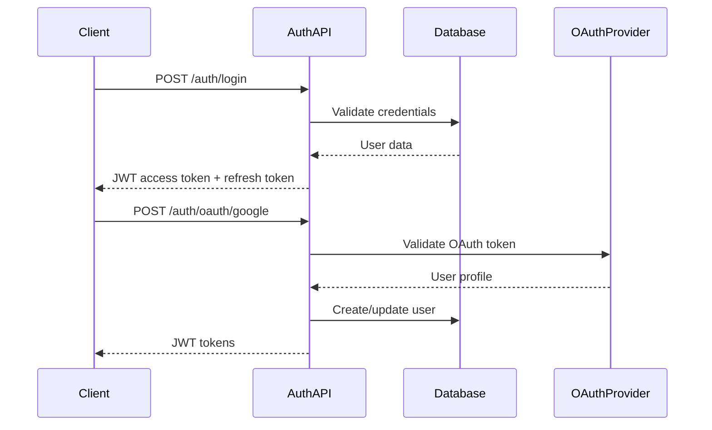

# User Authentication System - Technical Architecture EXAMPLE

**Version**: 1.0.0
**Created**: 2025-08-22
**Last Updated**: 2025-08-22
**Status**: Example Document
**Target Audience**: Developers, AI Assistants

## Summary & Status

This document demonstrates technical architecture documentation for a user authentication system. This is an example document showing the separation between technical implementation details (this document) and business requirements (see [User Authentication Deliverable](../deliverables/user-authentication-deliverable.md)).

### Current Implementation Status

- ✅ **Completed**: JWT token handling, password hashing, session management
- 🚧 **In Progress**: OAuth integration, multi-factor authentication
- ❌ **Not Implemented**: Advanced security monitoring, account lockout policies

## Requirements

### Functional Requirements

- **Authentication**: Email/password login with JWT tokens
- **Authorization**: Role-based access control (RBAC)
- **Session Management**: Secure session handling with refresh tokens
- **Password Security**: Bcrypt hashing with configurable salt rounds
- **OAuth Integration**: Support for Google, GitHub, and Microsoft providers

### Non-Functional Requirements

- **Performance**: Authentication requests must complete within 200ms
- **Security**: All passwords hashed with bcrypt (minimum 12 rounds)
- **Scalability**: Support for 10,000 concurrent sessions
- **Availability**: 99.9% uptime for authentication services

## Technical Details

### System Architecture



### Component Design

#### Authentication Service
- **Location**: `src/services/auth-service.ts`
- **Dependencies**: bcrypt, jsonwebtoken, oauth libraries
- **Responsibilities**: Token generation, password validation, OAuth handling

#### User Model
- **Location**: `src/models/user.ts`
- **Schema**: 
  - `id` (UUID, primary key)
  - `email` (unique, indexed)
  - `password_hash` (bcrypt)
  - `role` (enum: user, admin, moderator)
  - `oauth_providers` (JSON array)
  - `created_at`, `updated_at` (timestamps)

#### Middleware
- **Location**: `src/middleware/auth-middleware.ts`
- **Functions**: JWT validation, role checking, session management

## API & Data Models

### Authentication Endpoints

```typescript
// POST /api/auth/login
interface LoginRequest {
  email: string;
  password: string;
}

interface AuthResponse {
  access_token: string;
  refresh_token: string;
  user: {
    id: string;
    email: string;
    role: 'user' | 'admin' | 'moderator';
  };
}

// POST /api/auth/refresh
interface RefreshRequest {
  refresh_token: string;
}

// POST /api/auth/oauth/google
interface OAuthRequest {
  oauth_token: string;
  provider: 'google' | 'github' | 'microsoft';
}
```

### Database Schema

```sql
CREATE TABLE users (
  id UUID PRIMARY KEY DEFAULT gen_random_uuid(),
  email VARCHAR(255) UNIQUE NOT NULL,
  password_hash VARCHAR(255),
  role VARCHAR(50) DEFAULT 'user',
  oauth_providers JSONB DEFAULT '[]'::jsonb,
  is_verified BOOLEAN DEFAULT false,
  last_login_at TIMESTAMP,
  created_at TIMESTAMP DEFAULT NOW(),
  updated_at TIMESTAMP DEFAULT NOW()
);

CREATE INDEX idx_users_email ON users(email);
CREATE INDEX idx_users_role ON users(role);
```

## Testing Strategy

### Test Coverage

- **Unit Tests**: `src/services/__tests__/auth-service.test.ts`
- **Integration Tests**: `src/api/__tests__/auth-endpoints.test.ts`  
- **E2E Tests**: `cypress/integration/authentication.spec.ts`
- **Current Coverage**: 85% (Target: 95%)

### Test Scenarios

#### Unit Tests
- Password hashing and validation
- JWT token generation and verification
- OAuth token validation
- Role-based authorization logic

#### Integration Tests
- Complete login flow with database
- OAuth provider integration
- Session refresh mechanisms
- Error handling and edge cases

#### E2E Tests
- User registration and login flows
- Multi-factor authentication
- Account lockout scenarios
- Cross-browser compatibility

## Security & Performance

### Security Measures

- **Password Policy**: Minimum 8 characters, complexity requirements
- **Rate Limiting**: 5 login attempts per minute per IP
- **Token Security**: JWT with 15-minute expiry, refresh tokens with 7-day expiry
- **HTTPS Only**: All authentication endpoints require TLS
- **CORS Protection**: Strict origin validation

### Performance Optimizations

- **Database Indexing**: Optimized queries on email and role fields
- **Token Caching**: Redis cache for active sessions
- **Connection Pooling**: Database connection optimization
- **CDN Integration**: Static assets served via CDN

### Security Testing

- **Vulnerability Scanning**: OWASP ZAP integration in CI/CD
- **Penetration Testing**: Quarterly security assessments
- **Dependency Scanning**: Automated CVE checking

## Dependencies & Configuration

### Internal Dependencies

- **Database Layer**: `src/database/connection.ts`
- **Email Service**: `src/services/email-service.ts`
- **Logging Service**: `src/services/logger.ts`

### External Dependencies

```json
{
  "bcryptjs": "^2.4.3",
  "jsonwebtoken": "^9.0.2",
  "passport": "^0.6.0",
  "passport-google-oauth20": "^2.0.0",
  "passport-github2": "^0.1.12"
}
```

### Environment Configuration

```env
# JWT Configuration
JWT_SECRET=your-secret-key
JWT_EXPIRY=15m
REFRESH_TOKEN_EXPIRY=7d

# OAuth Configuration
GOOGLE_CLIENT_ID=your-google-client-id
GOOGLE_CLIENT_SECRET=your-google-client-secret
GITHUB_CLIENT_ID=your-github-client-id
GITHUB_CLIENT_SECRET=your-github-client-secret

# Security Configuration
BCRYPT_ROUNDS=12
SESSION_SECRET=your-session-secret
RATE_LIMIT_WINDOW=60000
RATE_LIMIT_MAX=5
```

## Monitoring & Documentation

### Observability

- **Metrics**: Authentication success/failure rates, response times
- **Logging**: All authentication attempts with sanitized data
- **Alerting**: Failed login spikes, service degradation
- **Health Checks**: `/api/auth/health` endpoint

### Error Handling

```typescript
enum AuthErrorCodes {
  INVALID_CREDENTIALS = 'AUTH_001',
  ACCOUNT_LOCKED = 'AUTH_002',
  OAUTH_ERROR = 'AUTH_003',
  TOKEN_EXPIRED = 'AUTH_004',
  RATE_LIMITED = 'AUTH_005'
}
```

### API Documentation

- **OpenAPI Spec**: `docs/api/auth-api.yaml`
- **Postman Collection**: `docs/postman/auth-collection.json`
- **SDK Documentation**: Auto-generated from TypeScript types

## Implementation Notes

### Development Workflow

1. **Local Development**: Use in-memory database for fast iteration
2. **Testing**: Automated test suite runs on every commit
3. **Staging**: Full OAuth integration testing
4. **Production**: Blue-green deployment strategy

### Migration Strategy

```typescript
// Migration: Add OAuth support
export async function up(knex: Knex): Promise<void> {
  return knex.schema.alterTable('users', (table) => {
    table.jsonb('oauth_providers').defaultTo('[]');
    table.boolean('is_verified').defaultTo(false);
  });
}
```

## Related Documentation

- **Product Requirements**: [User Authentication Deliverable](../deliverables/user-authentication-deliverable.md)
- **API Reference**: [Authentication API](../api/authentication-api.md)
- **Security Guidelines**: [Security Architecture](security-architecture.md)
- **Database Design**: [Data Layer Architecture](data-layer-architecture.md)

---

**Implementation Status**: This is an example document demonstrating technical architecture documentation. For business requirements and user impact, see the corresponding product deliverable document.