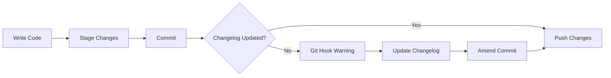
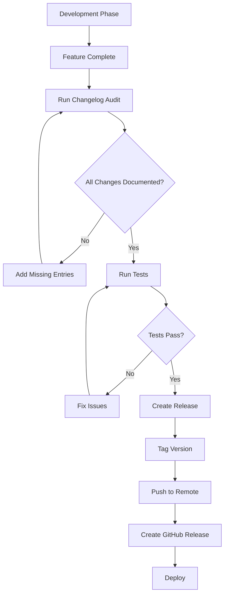

# Complete CHANGELOG System Guide

**Version**: 1.0.0  
**Created**: 2025-08-23  
**Status**: Active  
**Target Audience**: Developers, AI Assistants, Project Maintainers

## Table of Contents

1. [Overview](#overview)
2. [Getting Started](#getting-started)
3. [System Components](#system-components)
4. [Step-by-Step Workflows](#step-by-step-workflows)
5. [Script Documentation](#script-documentation)
6. [Best Practices and Conventions](#best-practices-and-conventions)
7. [Git Hooks Integration](#git-hooks-integration)
8. [Release Workflow](#release-workflow)
9. [Troubleshooting](#troubleshooting)
10. [Examples and Code Snippets](#examples-and-code-snippets)
11. [AI Assistant Guidelines](#ai-assistant-guidelines)

---

## Overview

The CHANGELOG system in this template provides a comprehensive, automated approach to maintaining professional project documentation. It ensures that all significant changes are tracked, categorized, and properly attributed throughout the development lifecycle.

### Key Features

- **Automated Change Detection**: Git hooks monitor commits and remind developers to update the changelog
- **AI-Friendly Tools**: Scripts designed specifically for AI assistants to maintain accurate changelogs
- **Release Automation**: Streamlined process for creating releases from changelog entries
- **Comprehensive Auditing**: Tools to identify missing entries and maintain changelog quality
- **Standards Compliance**: Follows [Keep a Changelog](https://keepachangelog.com/) and [Semantic Versioning](https://semver.org/)

### System Philosophy

1. **Every significant change should be documented** - If it affects users, it belongs in the changelog
2. **Documentation happens during development** - Not as an afterthought
3. **Automation prevents oversight** - Tools catch missing entries automatically
4. **Clear attribution matters** - Especially for AI-assisted development
5. **Releases should be painless** - One command to go from development to release

---

## Getting Started

### Initial Setup for New Projects

1. **Copy the CHANGELOG template to your project root:**

```bash
cp templates/CHANGELOG.template.md CHANGELOG.md
```

2. **Customize the template:**
   - Update the project name in the header
   - Adjust categories if needed (though the standard ones are recommended)
   - Set your initial version number if not starting at 0.1.0

3. **Make the scripts executable:**

```bash
chmod +x scripts/check-changelog.sh
chmod +x scripts/ai-update-changelog.sh
chmod +x scripts/ai-changelog-audit.sh
chmod +x scripts/release.sh
```

4. **Configure git hooks (optional but recommended):**

```bash
# Copy the check-changelog script to your git hooks
cp scripts/check-changelog.sh .git/hooks/pre-commit
chmod +x .git/hooks/pre-commit
```

### Quick Start Commands

```bash
# Check if your changelog is up to date
./scripts/ai-changelog-audit.sh

# Add a new entry interactively
./scripts/ai-update-changelog.sh add

# Analyze recent commits for missing entries
./scripts/ai-update-changelog.sh analyze

# Create a new release
./scripts/release.sh 0.1.0
```

---

## System Components

### 1. CHANGELOG.md Structure

The changelog follows a specific structure that enables both human readability and automated processing:

```markdown
# Changelog

All notable changes to this project will be documented in this file.

The format is based on [Keep a Changelog](https://keepachangelog.com/en/1.1.0/),
and this project adheres to [Semantic Versioning](https://semver.org/spec/v2.0.0.html).

## [Unreleased]

### Added
- New features

### Changed
- Changes in existing functionality

### Fixed
- Bug fixes

## [0.1.0] - 2025-08-23

### Added
- Initial release features
```

### 2. Category Types

Each change must be categorized into one of six standard types:

| Category | Description | Common Prefixes | Example |
|----------|-------------|-----------------|---------|
| **Added** | New features or capabilities | feat, add, new, implement | `- [ISSUE-001] Added user authentication system` |
| **Changed** | Modifications to existing functionality | update, change, modify, refactor | `- [ISSUE-002] Refactored database connection pooling` |
| **Deprecated** | Features marked for future removal | deprecate, obsolete | `- [TASK-003] Deprecated legacy API endpoints` |
| **Removed** | Deleted features or capabilities | remove, delete, drop | `- [ISSUE-004] Removed unused dependencies` |
| **Fixed** | Bug fixes and corrections | fix, bug, patch, resolve | `- [BUG-005] Fixed memory leak in worker process` |
| **Security** | Security patches and vulnerability fixes | security, vuln, CVE | `- [SEC-001] Patched XSS vulnerability in input handler` |

### 3. Entry Format Conventions

Standard entry formats ensure consistency and traceability:

```markdown
# Basic format
- [REFERENCE] Description of change

# Breaking change format
- **BREAKING**: [REFERENCE] Description of breaking change
  - Migration: Steps to update existing code

# AI-assisted development
- [ISSUE-001] Implemented OAuth2 authentication (AI-assisted)

# Multiple related changes
- [ISSUE-002] Redesigned user dashboard
  - Added real-time analytics widget
  - Improved mobile responsiveness
  - Fixed chart rendering issues
```

---

## Step-by-Step Workflows

### Workflow 1: Daily Development



**Steps:**

1. Make your code changes
2. Stage files: `git add .`
3. Commit: `git commit -m "feat: add user profile page"`
4. Git hook checks for changelog update
5. If missing, update CHANGELOG.md
6. Stage changelog: `git add CHANGELOG.md`
7. Amend commit: `git commit --amend`
8. Push changes

### Workflow 2: Working with Issues

1. **Start work on an issue:**
```bash
# Check the issue reference (e.g., ISSUE-001)
cat deliverables/auth/issues/001/ISSUE-001-plan.md
```

2. **Complete the implementation**

3. **Add changelog entry:**
```bash
# Interactive method
./scripts/ai-update-changelog.sh add

# Or direct method
./scripts/ai-update-changelog.sh add \
  --category Added \
  --reference ISSUE-001 \
  --message "User authentication system with OAuth2 support"
```

4. **Verify entry was added:**
```bash
grep "ISSUE-001" CHANGELOG.md
```

### Workflow 3: End of Sprint Review

1. **Audit recent work:**
```bash
# Check last 2 weeks of commits
./scripts/ai-changelog-audit.sh --since "2 weeks ago"
```

2. **Review missing entries:**
```bash
# Analyze and suggest entries
./scripts/ai-update-changelog.sh analyze --since "2 weeks ago"
```

3. **Add missing entries in batch:**
```bash
# For each missing entry
./scripts/ai-update-changelog.sh from-commit <commit-hash>
```

4. **Generate audit report:**
```bash
./scripts/ai-changelog-audit.sh --report
```

### Workflow 4: Preparing a Release

1. **Final audit:**
```bash
./scripts/ai-changelog-audit.sh
```

2. **Review unreleased section:**
```bash
# Check what will be included
grep -A 50 "\[Unreleased\]" CHANGELOG.md
```

3. **Create release:**
```bash
# Dry run first
./scripts/release.sh 0.2.0 --dry-run

# Execute release
./scripts/release.sh 0.2.0
```

---

## Script Documentation

### 1. check-changelog.sh

**Purpose**: Git hook that monitors commits and ensures changelog updates for significant changes.

**Location**: `scripts/check-changelog.sh`

**Features:**
- Detects code changes that should trigger changelog updates
- Suggests appropriate changelog entries based on commit messages
- Identifies issue/bug/task references automatically
- Detects AI-assisted commits for proper attribution
- Non-blocking by default (configurable)

**Configuration:**

```bash
# Excluded file patterns (won't trigger changelog requirement)
EXCLUDED_PATTERNS=(
    "^docs/"
    "^README"
    "^CHANGELOG"
    "^\.github/"
    "^scripts/"
    "^\.gitignore"
    "^package-lock\.json"
    "^yarn\.lock"
)

# File extensions that trigger changelog requirement
# .js, .ts, .jsx, .tsx, .py, .java, .go, .rs, .cpp, .c, .php, .rb, .swift, .kt, .scala, .sh
```

**Usage:**

```bash
# Manual check
./scripts/check-changelog.sh

# As git hook (automatic)
cp scripts/check-changelog.sh .git/hooks/pre-commit

# Skip check for a specific commit
git commit --no-verify -m "docs: update README"
```

**Output Example:**

```
⚠ Warning: Code changes detected without CHANGELOG update

Suggested CHANGELOG entry:

### Added
- [ISSUE-001] Implement user authentication system

Files changed:
src/auth/login.js
src/auth/register.js
src/models/user.js
... and 3 more files

Options:
1. Update CHANGELOG.md with your changes
2. Use --no-verify to skip this check (not recommended)
3. If changes don't affect users, consider documenting why
```

### 2. ai-update-changelog.sh

**Purpose**: Comprehensive tool for AI assistants and developers to manage changelog entries.

**Location**: `scripts/ai-update-changelog.sh`

**Commands:**

| Command | Description | Example |
|---------|-------------|---------|
| `analyze` | Analyze recent commits and suggest entries | `./scripts/ai-update-changelog.sh analyze --since "7 days ago"` |
| `add` | Add a new entry interactively or via flags | `./scripts/ai-update-changelog.sh add` |
| `from-commit` | Generate entry from specific commit | `./scripts/ai-update-changelog.sh from-commit HEAD` |
| `from-issue` | Extract entry from deliverable file | `./scripts/ai-update-changelog.sh from-issue deliverables/auth/issues/001/ISSUE-001-plan.md` |
| `audit` | Check for missing changelog entries | `./scripts/ai-update-changelog.sh audit` |
| `format` | Format and organize existing changelog | `./scripts/ai-update-changelog.sh format` |

**Interactive Add Example:**

```bash
$ ./scripts/ai-update-changelog.sh add

Add CHANGELOG Entry

Select category:
1) Added
2) Changed
3) Fixed
4) Removed
5) Deprecated
6) Security
Choice (1-6): 1

Reference (e.g., ISSUE-001, or leave empty): ISSUE-001
Entry message: Implemented user authentication with JWT
Is this a breaking change? (y/n): n

✓ Added to CHANGELOG.md under Added
  - [ISSUE-001] Implemented user authentication with JWT
```

**Programmatic Add Example:**

```bash
./scripts/ai-update-changelog.sh add \
  --category Fixed \
  --reference BUG-042 \
  --message "Memory leak in background worker process" \
  --breaking
```

### 3. ai-changelog-audit.sh

**Purpose**: Comprehensive audit tool that analyzes git history, deliverables, and changelog to identify gaps.

**Location**: `scripts/ai-changelog-audit.sh`

**Features:**
- Analyzes git commit history for missing entries
- Checks deliverables directory for undocumented work
- Identifies orphaned changelog entries
- Provides detailed statistics and health scores
- Generates actionable reports for AI assistants

**Options:**

```bash
Options:
  -v, --verbose     Show detailed information
  --since PERIOD    Analyze commits since (default: '30 days ago')
  --report          Generate actionable report for AI
  -h, --help        Show help message
```

**Usage Examples:**

```bash
# Basic audit
./scripts/ai-changelog-audit.sh

# Verbose output with extended timeframe
./scripts/ai-changelog-audit.sh -v --since "60 days ago"

# Generate AI-friendly report
./scripts/ai-changelog-audit.sh --report
```

**Output Example:**

```
╔══════════════════════════════════════════════════════════╗
║          AI CHANGELOG AUDIT TOOL v1.0.0                 ║
╚══════════════════════════════════════════════════════════╝

═══ Git Commit Analysis ═══

Missing CHANGELOG entries:
  ⚠ ISSUE-003 - Add password reset functionality
  ⚠ BUG-015 - Fix race condition in session handler
  ⚠ a5f3c21e - Refactor database connection pool (no ref)

═══ Deliverables Analysis ═══

  ✓ ISSUE-001 - In CHANGELOG
  ✓ ISSUE-002 - In CHANGELOG
  ⚠ ISSUE-003 - Has entry in plan but not in CHANGELOG
  ℹ TASK-001 - No changelog entry planned

Deliverables Summary:
  Total: 4
  In CHANGELOG: 2
  Missing: 1

═══ Summary Statistics ═══

Git Commits:
  Total analyzed: 47
  Documented: 38
  Missing: 9
  AI-assisted: 12
  Completion rate: 81%

Issue References:
  Total: 15
  Documented: 13
  Completion rate: 87%

Overall Health: Good (81%)

═══ AI Assistant Recommendations ═══

  ▸ Run: ./scripts/ai-update-changelog.sh analyze to review missing entries
  ▸ 26% of commits are AI-assisted - ensure proper attribution
```

### 4. release.sh

**Purpose**: Automates the entire release process, moving unreleased changes to a versioned release.

**Location**: `scripts/release.sh`

**Features:**
- Validates semantic version format
- Checks for version conflicts
- Moves unreleased entries to new version section
- Creates annotated git tags
- Commits and pushes changes
- Provides dry-run mode for safety

**Options:**

```bash
Arguments:
  version    Semantic version (e.g., 0.1.1, 1.0.0, 2.3.4)

Options:
  --dry-run  Show what would be done without making changes
  --no-tag   Don't create git tag
  --no-push  Don't push to remote
  --help     Show help message
```

**Usage Examples:**

```bash
# Preview release without changes
./scripts/release.sh 0.2.0 --dry-run

# Create local release without pushing
./scripts/release.sh 0.2.0 --no-push

# Full release process
./scripts/release.sh 0.2.0
```

**Release Process:**

1. Validates version number format
2. Checks for existing version/tag conflicts
3. Extracts unreleased content from CHANGELOG
4. Creates new version section with current date
5. Commits changelog updates
6. Creates annotated git tag with release notes
7. Pushes commits and tags to remote

**Output Example:**

```
🚀 Release Process for v0.2.0
════════════════════════════════

Updating CHANGELOG.md...
✓ CHANGELOG.md updated

Committing changes...
✓ Changes committed

Creating git tag v0.2.0...
✓ Git tag v0.2.0 created

Pushing to remote...
✓ Pushed to remote

Release Summary
═══════════════
Version: 0.2.0
Date: 2025-08-23
Tag: v0.2.0

Next steps:
1. Review the changes
2. Create a GitHub release from tag v0.2.0
3. Update any version references in documentation
4. Notify team of the new release
```

---

## Best Practices and Conventions

### 1. Writing Good Changelog Entries

**DO:**
- Write in present tense for unreleased, past tense for releases
- Start with a verb (Added, Fixed, Changed, etc.)
- Include issue/bug/task references for traceability
- Be specific but concise
- Focus on what changed from the user's perspective
- Group related changes under a single entry

**DON'T:**
- Include internal refactoring that doesn't affect users
- Write vague descriptions like "Various fixes"
- Duplicate information already in commit messages
- Include timestamps (the version date is sufficient)
- Mix different types of changes in one entry

### 2. Reference Numbering Conventions

Use consistent prefixes for different work types:

```markdown
ISSUE-XXX  - Feature implementations and enhancements
BUG-XXX    - Bug fixes and corrections
TASK-XXX   - Technical tasks and maintenance
SEC-XXX    - Security-related changes
PERF-XXX   - Performance improvements
DOC-XXX    - Documentation updates (if user-facing)
```

### 3. Breaking Changes

Always clearly mark breaking changes:

```markdown
### Changed
- **BREAKING**: [ISSUE-045] Renamed API endpoint from /user to /users
  - Migration: Update all API calls from `/api/v1/user` to `/api/v1/users`
  - Affected methods: GET, POST, PUT, DELETE
  - Old endpoint will be removed in v2.0.0
```

### 4. AI-Assisted Development Attribution

When AI tools assist in development:

```markdown
### Added
- [ISSUE-023] Implemented real-time chat system (AI-assisted)
  - WebSocket connection handling
  - Message persistence
  - Online status tracking
```

### 5. Version Number Guidelines

Follow [Semantic Versioning](https://semver.org/):

- **MAJOR** (X.0.0): Breaking changes
- **MINOR** (0.X.0): New features, backward compatible
- **PATCH** (0.0.X): Bug fixes, backward compatible

Examples:
- `0.1.0` → `0.1.1`: Bug fixes only
- `0.1.1` → `0.2.0`: New features added
- `0.2.0` → `1.0.0`: Breaking changes or major milestone

### 6. Commit Message Integration

Align commit messages with changelog entries:

```bash
# Commit message
git commit -m "fix(auth): resolve session timeout issue

- Fixed race condition in session renewal
- Added proper mutex locking
- Increased default timeout to 30 minutes

Fixes: BUG-042"

# Corresponding changelog entry
### Fixed
- [BUG-042] Fixed session timeout race condition in authentication module
```

---

## Git Hooks Integration

### Setting Up Pre-commit Hook

1. **Install the hook:**

```bash
# Method 1: Direct copy
cp scripts/check-changelog.sh .git/hooks/pre-commit
chmod +x .git/hooks/pre-commit

# Method 2: Symbolic link (tracks updates)
ln -s ../../scripts/check-changelog.sh .git/hooks/pre-commit
chmod +x .git/hooks/pre-commit
```

2. **Configure hook behavior:**

Edit `.git/hooks/pre-commit` to customize:

```bash
# Make hook blocking (default is non-blocking)
# Change line 206 from:
exit 0
# To:
exit 1

# Customize excluded patterns
EXCLUDED_PATTERNS=(
    "^docs/"
    "^test/"
    "^vendor/"
)
```

### Using with Husky

If using Husky for git hooks:

```json
// package.json
{
  "husky": {
    "hooks": {
      "pre-commit": "./scripts/check-changelog.sh"
    }
  }
}
```

### Environment Variables

The scripts recognize these environment variables:

```bash
# Indicate AI assistant context
export AI_ASSISTANT=true
export CLAUDE_CODE=true

# Skip changelog check
export SKIP_CHANGELOG_CHECK=true

# Verbose output
export VERBOSE=true
```

---

## Release Workflow

### Complete Release Process



### Step-by-Step Release Guide

1. **Preparation Phase:**

```bash
# Ensure clean working directory
git status

# Pull latest changes
git pull origin main

# Run comprehensive audit
./scripts/ai-changelog-audit.sh
```

2. **Documentation Phase:**

```bash
# Review unreleased changes
grep -A 100 "\[Unreleased\]" CHANGELOG.md

# Add any missing entries
./scripts/ai-update-changelog.sh analyze

# Verify all issues are documented
./scripts/ai-changelog-audit.sh --verbose
```

3. **Testing Phase:**

```bash
# Run full test suite
npm test  # or your test command

# Run linting
npm run lint

# Build project
npm run build
```

4. **Release Execution:**

```bash
# Dry run to preview
./scripts/release.sh 1.2.0 --dry-run

# Execute release
./scripts/release.sh 1.2.0

# Verify tag was created
git tag -l "v1.2.0"
```

5. **Post-Release:**

```bash
# Create GitHub release
# Go to: https://github.com/your-repo/releases/new
# Select tag: v1.2.0
# Copy release notes from CHANGELOG

# Update documentation
# - Version numbers in README
# - API documentation
# - Installation guides

# Notify stakeholders
# - Team announcement
# - User notification
# - Social media (if applicable)
```

### Hotfix Release Process

For urgent fixes:

```bash
# Create hotfix branch
git checkout -b hotfix/1.2.1

# Make fix and update changelog
vim CHANGELOG.md
# Add under [Unreleased]:
# ### Fixed
# - [BUG-100] Critical security vulnerability in auth module

# Commit changes
git add .
git commit -m "fix: critical security patch"

# Create release
./scripts/release.sh 1.2.1

# Merge back to main
git checkout main
git merge hotfix/1.2.1
git push origin main
```

---

## Troubleshooting

### Common Issues and Solutions

#### Issue 1: Changelog not found

**Error:**
```
Error: CHANGELOG.md not found
```

**Solution:**
```bash
# Create from template
cp templates/CHANGELOG.template.md CHANGELOG.md

# Or create minimal version
echo "# Changelog

## [Unreleased]
" > CHANGELOG.md
```

#### Issue 2: Version already exists

**Error:**
```
Error: Version 0.2.0 already exists in CHANGELOG
Error: Git tag v0.2.0 already exists
```

**Solution:**
```bash
# Check existing versions
grep "^## \[" CHANGELOG.md
git tag -l

# Use next version number
./scripts/release.sh 0.2.1
```

#### Issue 3: No unreleased changes

**Error:**
```
Warning: No unreleased changes found in CHANGELOG
Add changes to the [Unreleased] section first
```

**Solution:**
```bash
# Add recent commits to changelog
./scripts/ai-update-changelog.sh analyze

# Or manually add entries
vim CHANGELOG.md
# Add under [Unreleased] section
```

#### Issue 4: Git hook not triggering

**Problem:** Pre-commit hook doesn't run

**Solution:**
```bash
# Check hook exists and is executable
ls -la .git/hooks/pre-commit

# Make executable
chmod +x .git/hooks/pre-commit

# Test hook manually
.git/hooks/pre-commit
```

#### Issue 5: Incorrect category detection

**Problem:** Script suggests wrong category for changes

**Solution:**
```bash
# Use explicit category in commit message
git commit -m "fix: resolve memory leak"  # Will categorize as Fixed
git commit -m "feat: add new dashboard"   # Will categorize as Added

# Or specify manually when adding
./scripts/ai-update-changelog.sh add --category Fixed
```

#### Issue 6: Missing references in changelog

**Problem:** Issue references not being detected

**Solution:**
```bash
# Use standard format in commit messages
git commit -m "feat: add user profiles

Implements: ISSUE-001"

# Or include in subject line
git commit -m "feat(ISSUE-001): add user profiles"
```

### Debugging Scripts

Enable verbose output for debugging:

```bash
# Add -x flag for trace output
bash -x ./scripts/ai-changelog-audit.sh

# Or modify script temporarily
#!/bin/bash
set -x  # Add this line after shebang

# Use VERBOSE environment variable
VERBOSE=true ./scripts/ai-changelog-audit.sh
```

### Recovery Procedures

#### Recover from bad release

```bash
# Delete local tag
git tag -d v1.2.0

# Delete remote tag
git push origin :refs/tags/v1.2.0

# Revert changelog commit
git revert HEAD

# Fix issues and re-release
./scripts/release.sh 1.2.0
```

#### Fix changelog conflicts

```bash
# During merge conflict in CHANGELOG.md
git status

# Manual resolution
vim CHANGELOG.md
# Keep both sets of changes
# Ensure proper formatting

# Or use theirs/ours
git checkout --theirs CHANGELOG.md
# Add your changes back

git add CHANGELOG.md
git commit
```

---

## Examples and Code Snippets

### Example 1: Complete Feature Implementation

```bash
# 1. Start feature branch
git checkout -b feature/user-notifications

# 2. Implement feature
# ... code changes ...

# 3. Add changelog entry during development
cat >> CHANGELOG.md << 'EOF'
## [Unreleased]

### Added
- [ISSUE-050] Email and push notification system
  - Configurable notification preferences
  - Email template system
  - Push notification support for mobile
  - Notification history tracking
EOF

# 4. Commit with reference
git add .
git commit -m "feat(ISSUE-050): implement notification system

- Added email notifications with templates
- Implemented push notifications for mobile
- Created preference management UI
- Added notification history

Co-Authored-By: Claude"

# 5. Push and create PR
git push origin feature/user-notifications
```

### Example 2: Bug Fix Workflow

```bash
# 1. Identify bug
./scripts/ai-changelog-audit.sh
# Shows: BUG-075 not in changelog

# 2. Fix bug
vim src/auth/session.js
# ... fix code ...

# 3. Add changelog entry
./scripts/ai-update-changelog.sh add \
  --category Fixed \
  --reference BUG-075 \
  --message "Session timeout not being properly reset on activity"

# 4. Commit
git add .
git commit -m "fix(BUG-075): correct session timeout reset logic"

# 5. Verify
grep "BUG-075" CHANGELOG.md
```

### Example 3: Multiple Related Changes

```markdown
## [Unreleased]

### Changed
- [ISSUE-089] Complete redesign of admin dashboard
  - Modernized UI with new design system
  - Added real-time analytics widgets
  - Implemented role-based access control
  - Improved mobile responsiveness
  - Added dark mode support
  - Performance: 3x faster load times
  - **Breaking**: Changed API response format for /admin/stats
    - Migration: Update clients to handle nested data structure
```

### Example 4: Security Update

```markdown
## [Unreleased]

### Security
- [SEC-001] **CRITICAL**: Fixed SQL injection vulnerability in search endpoint
  - Affected versions: 1.0.0 - 1.2.3
  - CVE: CVE-2024-12345
  - Credit: Reported by security@example.com
  - Mitigation: Update to 1.2.4 immediately
```

### Example 5: Deprecation Notice

```markdown
## [Unreleased]

### Deprecated
- [TASK-040] Legacy REST API v1 endpoints
  - Will be removed in version 2.0.0
  - Migration guide: See docs/api-migration-v2.md
  - New endpoints available at /api/v2/
```

### Example 6: Performance Improvements

```markdown
## [Unreleased]

### Changed
- [PERF-012] Optimized database query performance
  - Reduced average query time by 60%
  - Added intelligent caching layer
  - Implemented connection pooling
  - Benchmark: 10k req/s → 25k req/s
```

---

## AI Assistant Guidelines

### For AI Assistants Using This System

#### Session Start Protocol

```bash
# 1. Check current changelog status
./scripts/ai-changelog-audit.sh

# 2. Review recent commits
git log --oneline -10

# 3. Check for active work items
ls deliverables/*/issues/*/

# 4. Verify changelog is current
./scripts/ai-update-changelog.sh analyze --since "1 day ago"
```

#### During Development

1. **After implementing features:**
   - Immediately update CHANGELOG.md
   - Include issue reference
   - Mark as AI-assisted when applicable

2. **Commit message format:**
```bash
git commit -m "type(scope): description

- Detail 1
- Detail 2

Implements: ISSUE-XXX
Co-Authored-By: Claude"
```

3. **Before session end:**
```bash
# Run comprehensive audit
./scripts/ai-changelog-audit.sh --verbose

# Generate report for handoff
./scripts/ai-changelog-audit.sh --report

# Update status files
echo "Changelog updated for: ISSUE-001, ISSUE-002" >> deliverables/status.md
```

#### AI-Specific Best Practices

1. **Always attribute AI assistance:**
```markdown
- [ISSUE-001] Implemented feature (AI-assisted)
```

2. **Break complex changes into clear points:**
```markdown
- [ISSUE-002] Refactored authentication system
  - Migrated to JWT tokens
  - Added refresh token support
  - Implemented rate limiting
  - Updated all endpoints
```

3. **Provide migration guides for breaking changes:**
```markdown
- **BREAKING**: [ISSUE-003] Changed user API response format
  - Migration: Update clients to use `user.profile.name` instead of `user.name`
  - Old format supported until v2.0.0 with deprecation warning
```

4. **Include context for future AI sessions:**
```markdown
- [TASK-004] Database optimization (Phase 1 of 3)
  - Completed index analysis
  - Next: Implement missing indexes (TASK-005)
```

### Automated Workflow for AI

```python
# Pseudo-code for AI changelog workflow

def on_session_start():
    run_command("./scripts/ai-changelog-audit.sh")
    check_deliverables()
    review_recent_commits()

def after_code_change(files_changed, commit_message):
    if significant_change(files_changed):
        reference = extract_reference(commit_message)
        category = determine_category(commit_message)
        
        add_changelog_entry(
            category=category,
            reference=reference,
            message=commit_message,
            ai_assisted=True
        )
    
    run_command("git add CHANGELOG.md")

def before_session_end():
    run_command("./scripts/ai-changelog-audit.sh --report")
    update_status_files()
    commit_all_changes()
    
def on_release_request(version):
    run_command(f"./scripts/release.sh {version} --dry-run")
    if confirm():
        run_command(f"./scripts/release.sh {version}")
```

---

## Appendix: Quick Reference Card

### Essential Commands

```bash
# Check status
./scripts/ai-changelog-audit.sh

# Add entry
./scripts/ai-update-changelog.sh add

# Analyze commits
./scripts/ai-update-changelog.sh analyze

# Create release
./scripts/release.sh X.Y.Z

# From specific commit
./scripts/ai-update-changelog.sh from-commit HEAD

# From issue file
./scripts/ai-update-changelog.sh from-issue path/to/ISSUE-XXX-plan.md
```

### Categories Quick Reference

- **Added**: New features (`feat`, `add`, `new`)
- **Changed**: Modifications (`update`, `change`, `refactor`)
- **Deprecated**: Marked for removal (`deprecate`)
- **Removed**: Deletions (`remove`, `delete`)
- **Fixed**: Bug fixes (`fix`, `bug`, `resolve`)
- **Security**: Security fixes (`security`, `CVE`)

### Entry Templates

```markdown
# Standard entry
- [ISSUE-XXX] Description of change

# Breaking change
- **BREAKING**: [ISSUE-XXX] Description
  - Migration: How to update

# AI-assisted
- [ISSUE-XXX] Description (AI-assisted)

# Multiple items
- [ISSUE-XXX] Main description
  - Sub-item 1
  - Sub-item 2
```

### Commit Message Prefixes

```
feat:     → Added
fix:      → Fixed
docs:     → (Usually skipped)
style:    → (Usually skipped)
refactor: → Changed
perf:     → Changed
test:     → (Usually skipped)
chore:    → (Usually skipped)
security: → Security
breaking: → **BREAKING**
```

---

## Conclusion

The CHANGELOG system provides a robust, automated approach to maintaining project documentation. By following this guide and using the provided tools, teams can ensure that their changelog remains accurate, comprehensive, and useful throughout the development lifecycle.

Remember: A well-maintained changelog is not just documentation—it's a communication tool that builds trust with users and provides a clear history of project evolution.

For questions or contributions to this guide, please refer to the project's contribution guidelines.