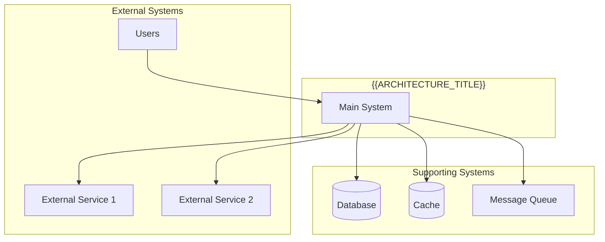
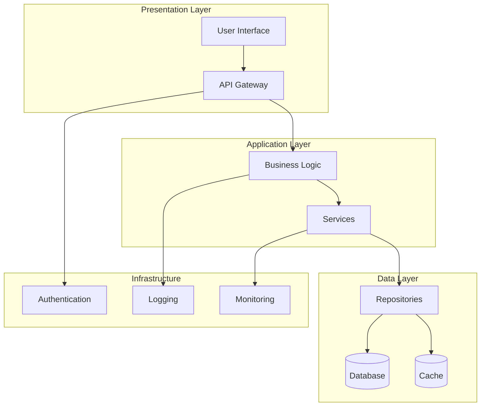
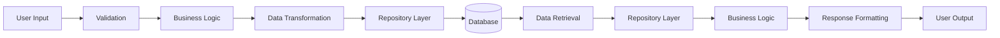
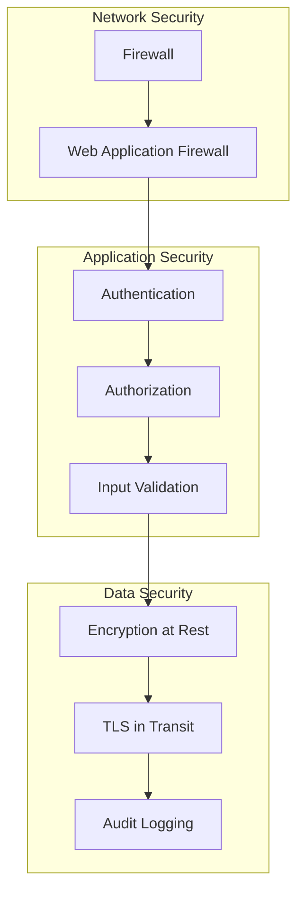
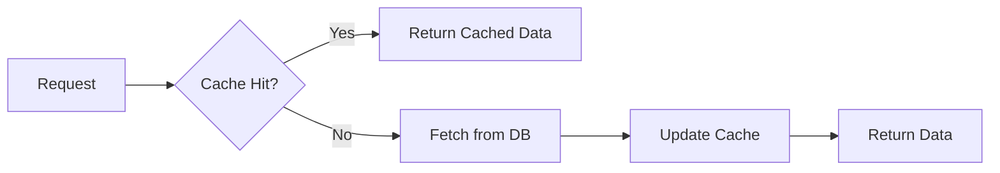
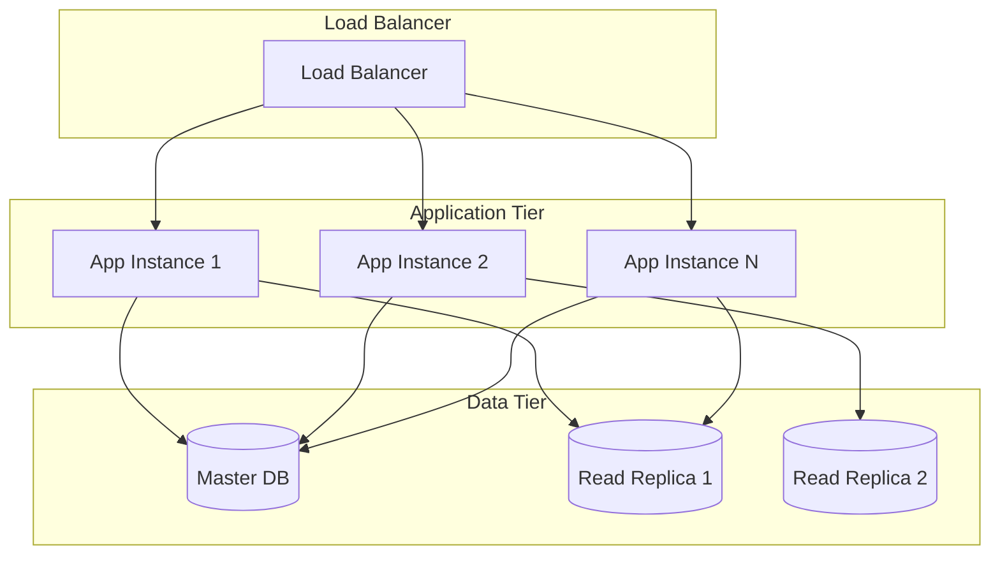
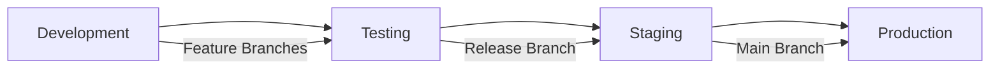
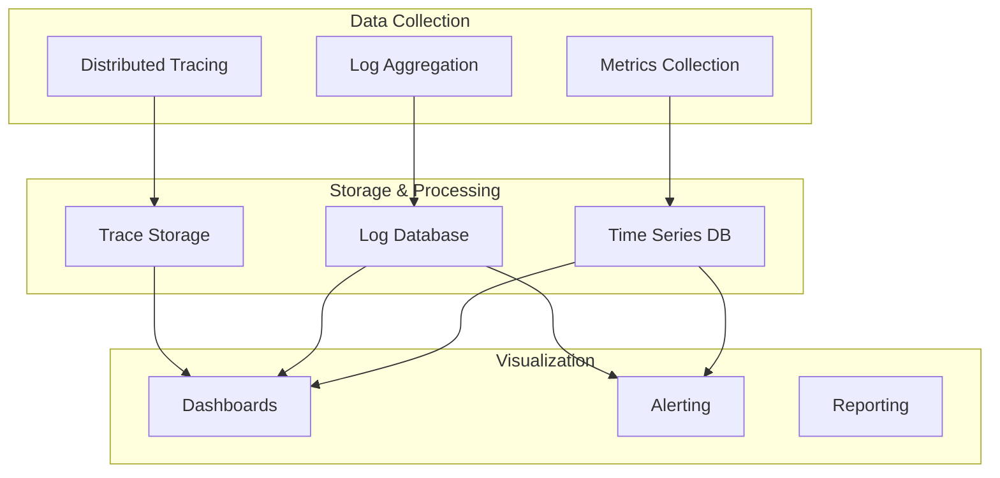
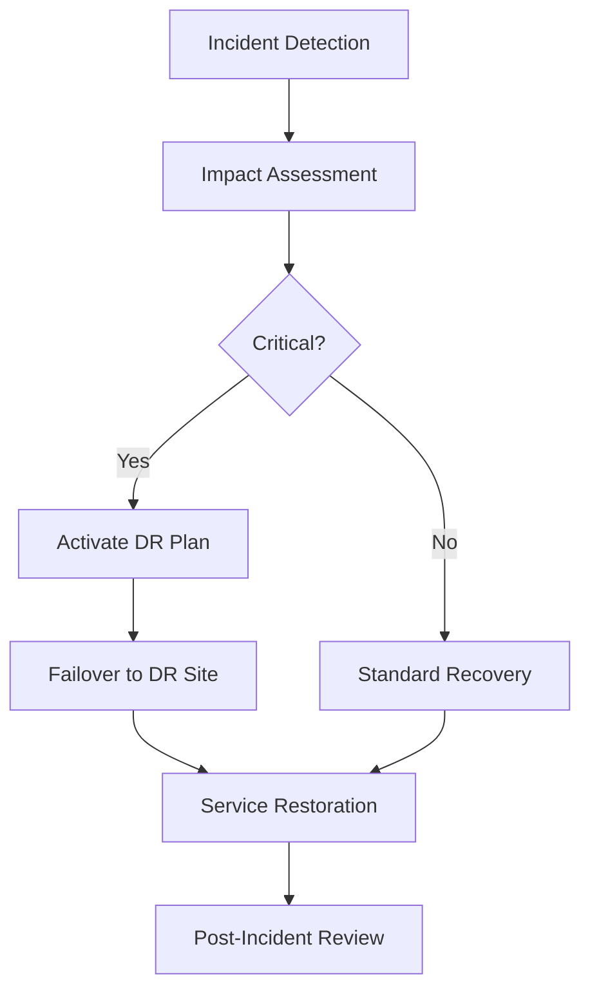

# {{ARCHITECTURE_TITLE}} Architecture

**Created**: {{CREATED}}
**Last Updated**: {{LAST_UPDATED}}
**Status**: {{STATUS}}
**Target Audience**: {{TARGET_AUDIENCE}}
**Architecture Version**: {{ARCHITECTURE_VERSION}}
**Scope**: {{ARCHITECTURE_SCOPE}}

## Overview

High-level architectural description of {{ARCHITECTURE_TITLE}} and its role within the larger system.

## System Context



## Architecture Principles

### Core Principles
1. **{{PRINCIPLE_1}}**: Description and rationale
2. **{{PRINCIPLE_2}}**: Description and rationale  
3. **{{PRINCIPLE_3}}**: Description and rationale

### Design Philosophy
- **Scalability**: How the system handles growth
- **Reliability**: Fault tolerance and availability approach
- **Maintainability**: How changes and updates are managed
- **Security**: Security-first design considerations
- **Performance**: Performance optimization strategies

## System Architecture

### High-Level Architecture



### Component Breakdown

#### Presentation Layer
- **User Interface**: {{UI_DESCRIPTION}}
  - Technology: {{UI_TECHNOLOGY}}
  - Responsibilities: User interaction, data presentation
  - Dependencies: API Gateway, Authentication service

- **API Gateway**: {{API_DESCRIPTION}}
  - Technology: {{API_TECHNOLOGY}}
  - Responsibilities: Request routing, rate limiting, authentication
  - Dependencies: Authentication service, backend services

#### Application Layer
- **Business Logic**: {{BUSINESS_LOGIC_DESCRIPTION}}
  - Technology: {{BL_TECHNOLOGY}}
  - Responsibilities: Core business rules, workflow orchestration
  - Dependencies: Services, repositories

- **Services**: {{SERVICES_DESCRIPTION}}
  - Technology: {{SERVICES_TECHNOLOGY}}
  - Responsibilities: Domain-specific operations, external integrations
  - Dependencies: Repositories, external APIs

#### Data Layer
- **Repositories**: {{REPOSITORY_DESCRIPTION}}
  - Technology: {{REPO_TECHNOLOGY}}
  - Responsibilities: Data access abstraction, query optimization
  - Dependencies: Database, cache

- **Database**: {{DATABASE_DESCRIPTION}}
  - Technology: {{DATABASE_TECHNOLOGY}}
  - Responsibilities: Data persistence, ACID transactions
  - Dependencies: None

- **Cache**: {{CACHE_DESCRIPTION}}
  - Technology: {{CACHE_TECHNOLOGY}}
  - Responsibilities: Performance optimization, session storage
  - Dependencies: Database (for cache invalidation)

## Data Architecture

### Data Flow



### Data Models

#### Core Entities

```typescript
interface {{ENTITY_1}} {
  id: string;
  name: string;
  status: 'active' | 'inactive';
  metadata: Record<string, any>;
  createdAt: Date;
  updatedAt: Date;
}

interface {{ENTITY_2}} {
  id: string;
  {{ENTITY_1}}Id: string;
  type: string;
  configuration: {{ENTITY_2}}Config;
  createdAt: Date;
}

interface {{ENTITY_2}}Config {
  enabled: boolean;
  settings: Record<string, any>;
}
```

#### Relationships

```mermaid
erDiagram
    {{ENTITY_1}} ||--o{ {{ENTITY_2}} : "has many"
    {{ENTITY_2}} ||--o{ {{ENTITY_3}} : "contains"
    {{ENTITY_1}} ||--o{ {{ENTITY_4}} : "owns"
```

### Database Schema

```sql
-- {{ENTITY_1}} table
CREATE TABLE {{ENTITY_1}}s (
    id UUID PRIMARY KEY DEFAULT gen_random_uuid(),
    name VARCHAR(255) NOT NULL,
    status VARCHAR(50) DEFAULT 'active',
    metadata JSONB,
    created_at TIMESTAMP DEFAULT CURRENT_TIMESTAMP,
    updated_at TIMESTAMP DEFAULT CURRENT_TIMESTAMP
);

-- {{ENTITY_2}} table
CREATE TABLE {{ENTITY_2}}s (
    id UUID PRIMARY KEY DEFAULT gen_random_uuid(),
    {{ENTITY_1}}_id UUID REFERENCES {{ENTITY_1}}s(id),
    type VARCHAR(100) NOT NULL,
    configuration JSONB,
    created_at TIMESTAMP DEFAULT CURRENT_TIMESTAMP
);

-- Indexes for performance
CREATE INDEX idx_{{ENTITY_1}}_status ON {{ENTITY_1}}s(status);
CREATE INDEX idx_{{ENTITY_2}}_{{ENTITY_1}}_id ON {{ENTITY_2}}s({{ENTITY_1}}_id);
```

## Security Architecture

### Security Layers



### Security Controls

#### Authentication
- **Method**: {{AUTH_METHOD}}
- **Token Type**: {{TOKEN_TYPE}}
- **Session Management**: {{SESSION_MANAGEMENT}}
- **Multi-Factor Authentication**: {{MFA_APPROACH}}

#### Authorization
- **Model**: {{AUTHZ_MODEL}}
- **Roles**: {{ROLE_DEFINITION}}
- **Permissions**: {{PERMISSION_MODEL}}
- **Access Control**: {{ACCESS_CONTROL}}

#### Data Protection
- **Encryption**: {{ENCRYPTION_APPROACH}}
- **Key Management**: {{KEY_MANAGEMENT}}
- **Data Classification**: {{DATA_CLASSIFICATION}}
- **Backup Security**: {{BACKUP_SECURITY}}

## Performance Architecture

### Performance Targets

| Metric | Target | Current | Notes |
|--------|--------|---------|-------|
| Response Time | < 200ms | {{CURRENT_RESPONSE_TIME}} | 95th percentile |
| Throughput | {{TARGET_THROUGHPUT}} req/s | {{CURRENT_THROUGHPUT}} req/s | Peak load |
| Availability | 99.9% | {{CURRENT_AVAILABILITY}}% | Monthly SLA |
| CPU Usage | < 70% | {{CURRENT_CPU}}% | Average |
| Memory Usage | < 80% | {{CURRENT_MEMORY}}% | Peak |

### Performance Optimizations

#### Caching Strategy


**Cache Layers**:
- **Level 1**: In-memory application cache ({{L1_CACHE_SIZE}})
- **Level 2**: Distributed cache ({{L2_CACHE_SIZE}})
- **Level 3**: Database query cache (automatic)

#### Database Optimization
- **Indexing Strategy**: {{INDEXING_STRATEGY}}
- **Query Optimization**: {{QUERY_OPTIMIZATION}}
- **Connection Pooling**: {{CONNECTION_POOLING}}
- **Read Replicas**: {{READ_REPLICAS}}

## Scalability Architecture

### Horizontal Scaling



### Auto-Scaling Strategy
- **CPU Threshold**: Scale out at {{CPU_THRESHOLD}}%
- **Memory Threshold**: Scale out at {{MEMORY_THRESHOLD}}%
- **Response Time Threshold**: Scale out at {{RESPONSE_THRESHOLD}}ms
- **Minimum Instances**: {{MIN_INSTANCES}}
- **Maximum Instances**: {{MAX_INSTANCES}}

## Deployment Architecture

### Environment Strategy



### Infrastructure as Code

```yaml
# Example deployment configuration
environments:
  development:
    instances: 1
    instance_type: "small"
    database: "shared"
  
  staging:
    instances: 2
    instance_type: "medium"
    database: "dedicated"
  
  production:
    instances: 5
    instance_type: "large"
    database: "cluster"
    backup_strategy: "daily"
    monitoring: "comprehensive"
```

## Monitoring and Observability

### Monitoring Stack



### Key Metrics
- **Application Metrics**: Request rate, error rate, response time
- **Infrastructure Metrics**: CPU, memory, disk, network
- **Business Metrics**: User engagement, conversion rates
- **Security Metrics**: Failed login attempts, suspicious activity

## Disaster Recovery

### Backup Strategy
- **Database Backups**: {{BACKUP_FREQUENCY}} with {{BACKUP_RETENTION}}
- **Application Backups**: Configuration and deployment artifacts
- **Disaster Recovery Site**: {{DR_STRATEGY}}
- **Recovery Time Objective (RTO)**: {{RTO}}
- **Recovery Point Objective (RPO)**: {{RPO}}

### Business Continuity


## Technology Stack

### Development Stack
- **Frontend**: {{FRONTEND_TECH}}
- **Backend**: {{BACKEND_TECH}}
- **Database**: {{DATABASE_TECH}}
- **Cache**: {{CACHE_TECH}}
- **Message Queue**: {{QUEUE_TECH}}

### Infrastructure Stack
- **Cloud Provider**: {{CLOUD_PROVIDER}}
- **Container Platform**: {{CONTAINER_PLATFORM}}
- **Orchestration**: {{ORCHESTRATION}}
- **CI/CD**: {{CICD_PLATFORM}}
- **Monitoring**: {{MONITORING_STACK}}

## Decision Records

### ADR-001: {{DECISION_TITLE_1}}
- **Status**: {{DECISION_STATUS}}
- **Decision**: {{DECISION_DESCRIPTION}}
- **Rationale**: {{DECISION_RATIONALE}}
- **Consequences**: {{DECISION_CONSEQUENCES}}

### ADR-002: {{DECISION_TITLE_2}}
- **Status**: {{DECISION_STATUS_2}}
- **Decision**: {{DECISION_DESCRIPTION_2}}
- **Rationale**: {{DECISION_RATIONALE_2}}
- **Consequences**: {{DECISION_CONSEQUENCES_2}}

## Future Considerations

### Planned Improvements
1. **{{IMPROVEMENT_1}}**: Timeline and expected benefits
2. **{{IMPROVEMENT_2}}**: Timeline and expected benefits
3. **{{IMPROVEMENT_3}}**: Timeline and expected benefits

### Technical Debt
- **Item 1**: Description and prioritization
- **Item 2**: Description and prioritization
- **Item 3**: Description and prioritization

### Emerging Technologies
- **Technology 1**: Evaluation status and potential impact
- **Technology 2**: Evaluation status and potential impact

## Related Documentation

- [API Documentation](../api/{{API_NAME}}.md)
- [Deployment Guide](../deployment/{{DEPLOYMENT_GUIDE}}.md)
- [Security Guide](../security/{{SECURITY_GUIDE}}.md)
- [Performance Testing](../testing/{{PERFORMANCE_GUIDE}}.md)

---

*Last reviewed: {{LAST_UPDATED}}*
*Architecture review scheduled: {{NEXT_REVIEW_DATE}}*