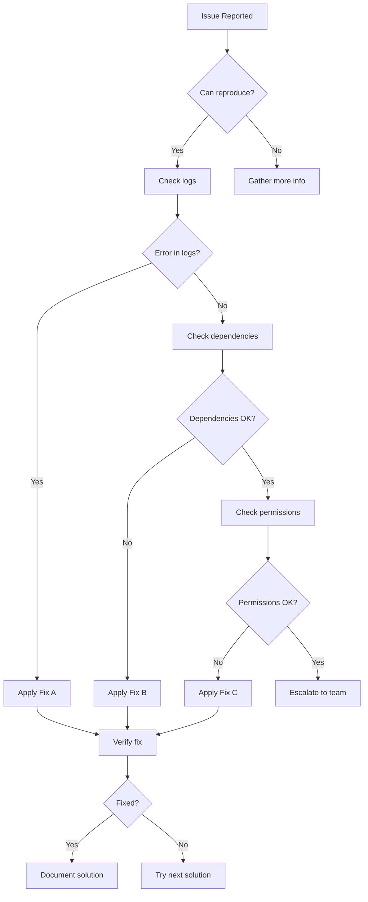

# {{ISSUE_TITLE}} Troubleshooting Guide

## Problem Description

Brief description of the {{ISSUE_TITLE}} issue and its symptoms.

## Symptoms

- Symptom 1: Description of what users experience
- Symptom 2: Another observable issue
- Symptom 3: Additional indicators of the problem

## Quick Fix

If you need an immediate solution:

```bash
# Quick command or configuration change
# Example command here
```

**⚠️ Warning**: This is a temporary fix. Follow the complete solution below for a permanent resolution.

## Complete Solution

### Step 1: Diagnosis

First, verify the issue by checking:

```bash
# Diagnostic commands
echo "Checking system status..."
# Add diagnostic commands here
```

Expected output:
```
Normal output should look like this
```

If you see different output, proceed to Step 2.

### Step 2: Root Cause Analysis

Common causes of this issue:

1. **Cause 1**: Configuration issue
   - Check: Configuration files
   - Look for: Specific settings or values
   
2. **Cause 2**: Dependency problem  
   - Check: Package versions or service status
   - Look for: Version conflicts or missing dependencies
   
3. **Cause 3**: Permission or access issue
   - Check: File permissions or user access
   - Look for: Permission denied errors

### Step 3: Fix Implementation

Choose the appropriate fix based on your diagnosis:

#### Fix A: Configuration Issue
```bash
# Commands to fix configuration
echo "Applying configuration fix..."
# Add specific commands
```

#### Fix B: Dependency Issue
```bash
# Commands to fix dependencies
echo "Resolving dependency issues..."
# Add specific commands
```

#### Fix C: Permission Issue
```bash
# Commands to fix permissions
echo "Updating permissions..."
# Add specific commands
```

### Step 4: Verification

After applying the fix, verify the solution:

```bash
# Verification commands
echo "Verifying fix..."
# Add verification commands
```

Expected result: {{EXPECTED_RESULT}}

## Troubleshooting Decision Tree



## Advanced Troubleshooting

### Debug Mode

Enable debug logging:

```bash
# Enable debug mode
export DEBUG=true
export LOG_LEVEL=debug

# Run the problematic operation
# Add specific debug commands
```

### Log Analysis

Key log locations:
- Application logs: `/path/to/app.log`
- System logs: `/path/to/system.log`
- Error logs: `/path/to/error.log`

Search for these patterns:
```bash
# Common error patterns
grep -i "error\|exception\|failed" /path/to/logs/
grep -i "{{ISSUE_TITLE}}" /path/to/logs/
```

### System Information

Collect system information for further analysis:

```bash
# System info collection script
echo "=== System Information ==="
uname -a
echo "=== Memory Usage ==="
free -h
echo "=== Disk Usage ==="
df -h
echo "=== Process Information ==="
ps aux | grep {{PROCESS_NAME}}
```

## Prevention

### Monitoring Setup

Set up monitoring to catch this issue early:

```bash
# Monitoring commands or configuration
# Add specific monitoring setup
```

### Health Checks

Regular health checks to prevent the issue:

```bash
# Health check script
#!/bin/bash
echo "Running health checks..."
# Add health check commands
```

Schedule this script to run:
```bash
# Add to crontab
0 */6 * * * /path/to/health-check.sh
```

### Best Practices

- Practice 1: Specific preventive measure
- Practice 2: Another preventive approach
- Practice 3: Configuration or maintenance task

## Common Variations

### Variation 1: {{VARIATION_NAME}}

**Symptoms**: Specific symptoms for this variation
**Cause**: Why this variation occurs
**Solution**: 
```bash
# Commands specific to this variation
```

### Variation 2: {{VARIATION_NAME_2}}

**Symptoms**: Different symptoms pattern
**Cause**: Root cause for this variation
**Solution**:
```bash
# Different commands for this variation
```

## Known Issues and Limitations

### Issue 1
- **Description**: What the known issue is
- **Workaround**: Temporary solution
- **Status**: When it will be fixed

### Issue 2
- **Description**: Another known limitation
- **Workaround**: Alternative approach
- **Status**: Timeline for resolution

## FAQ

### Q: Why does this issue occur?
A: Explanation of the root causes and contributing factors.

### Q: How can I prevent this from happening again?
A: List of preventive measures and best practices.

### Q: What should I do if the fix doesn't work?
A: Escalation path and additional troubleshooting steps.

### Q: Are there any side effects from the fix?
A: Description of any impacts or considerations.

## When to Escalate

Escalate to the development team if:

- [ ] None of the provided solutions work
- [ ] The issue affects critical functionality
- [ ] You encounter new error messages not covered here
- [ ] The problem persists after multiple fix attempts
- [ ] Data corruption or loss is suspected

## Escalation Information

**Primary Contact**: {{ESCALATION_CONTACT}}
**Secondary Contact**: {{SECONDARY_CONTACT}}
**Priority Level**: {{PRIORITY_LEVEL}}

**Information to Include**:
- Steps already attempted
- Complete error messages
- System information output
- Timeline of when the issue started
- Impact assessment

## Related Issues

- [Related Issue 1](link-to-related-issue)
- [Related Issue 2](link-to-related-issue)
- [Related Issue 3](link-to-related-issue)

## Documentation References

- [System Architecture](../architecture.md)
- [Configuration Guide](../configuration.md)
- [Monitoring Setup](../monitoring.md)

## Change Log

### Recent Updates
- **{{LAST_UPDATED}}**: Updated solution steps and added new troubleshooting commands
- **Previous Date**: Added FAQ section and escalation procedures

---

*Last reviewed: {{LAST_UPDATED}}*
*Need help? Contact {{SUPPORT_CONTACT}}*