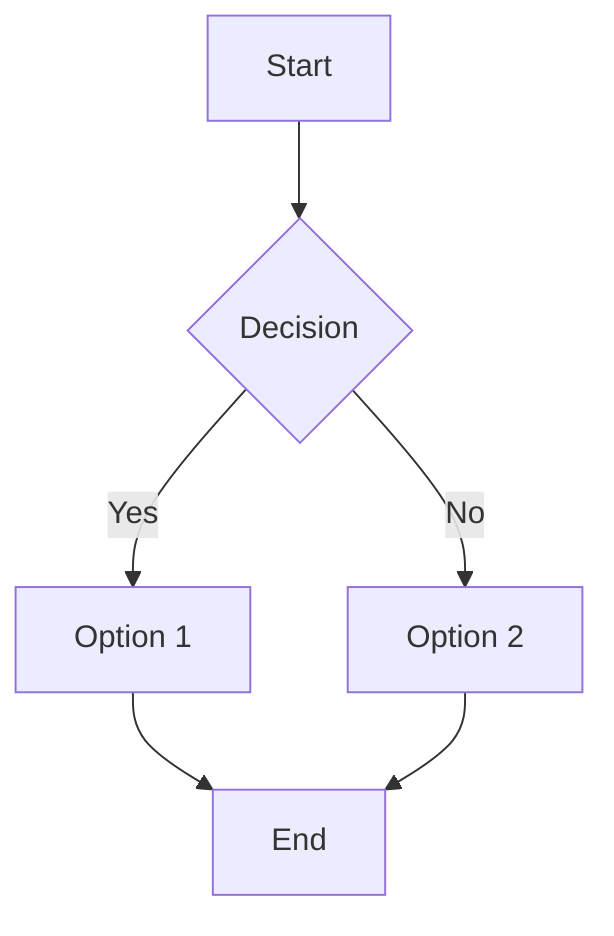
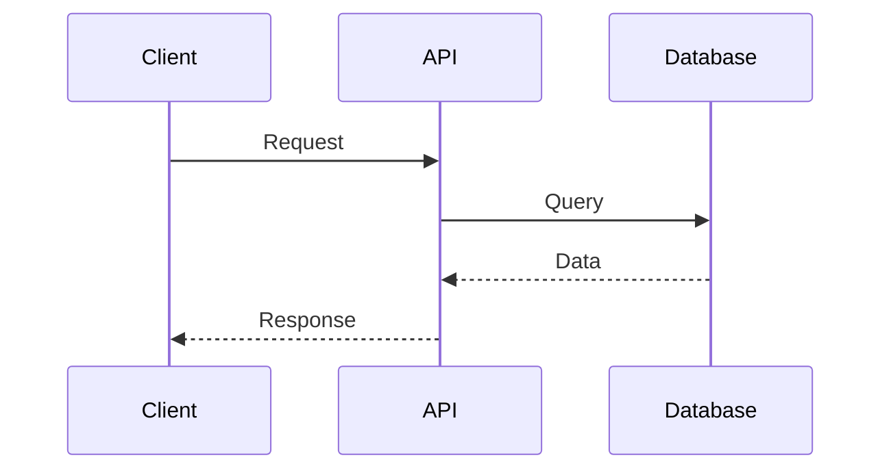
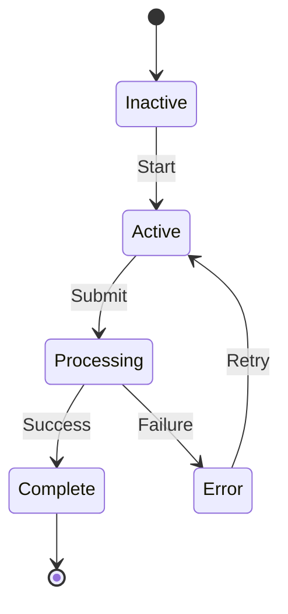
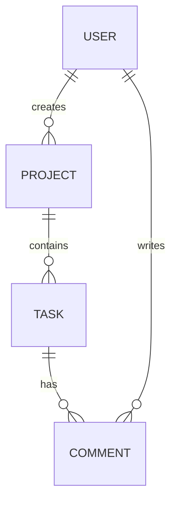
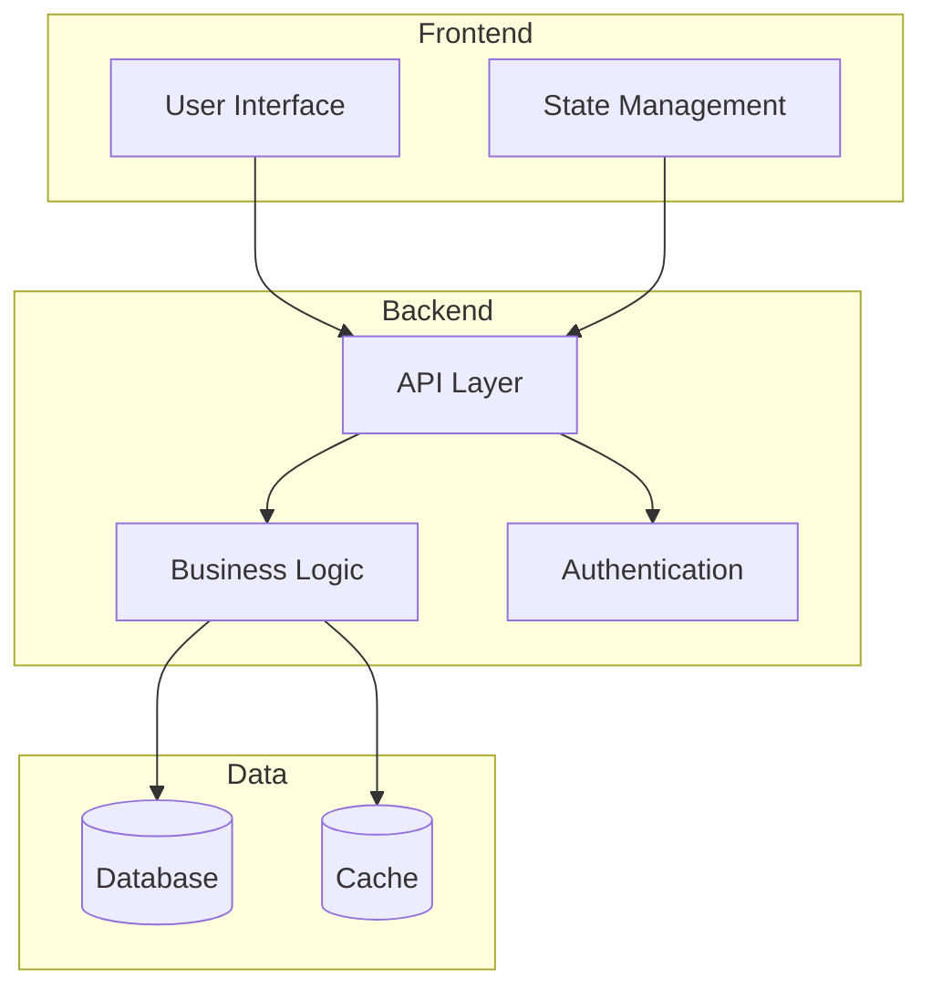
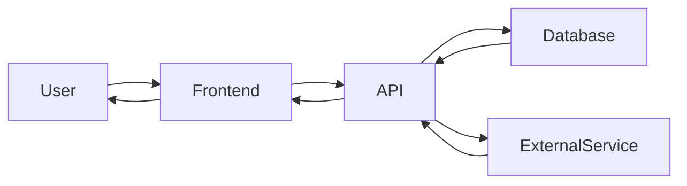
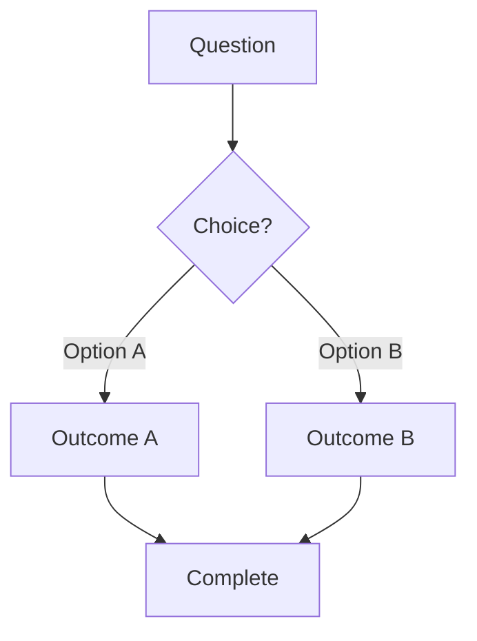
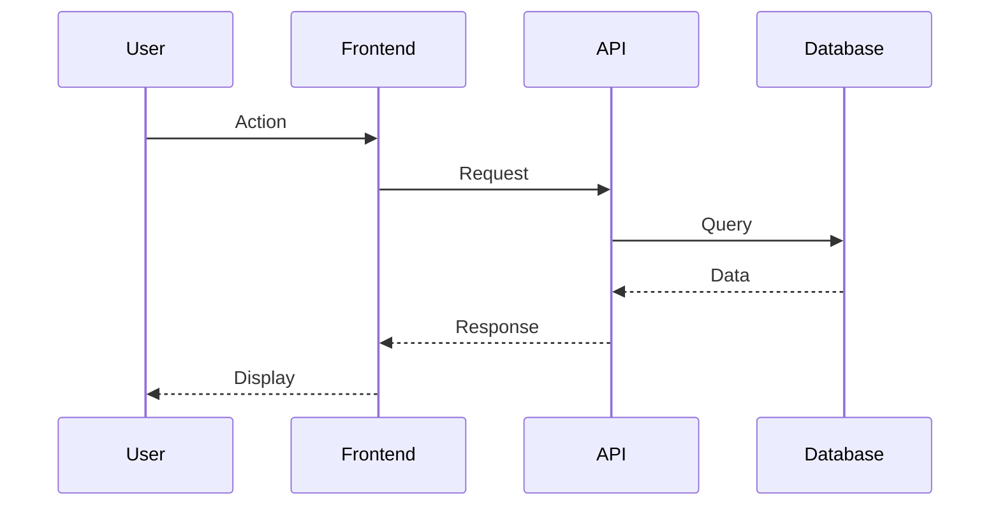
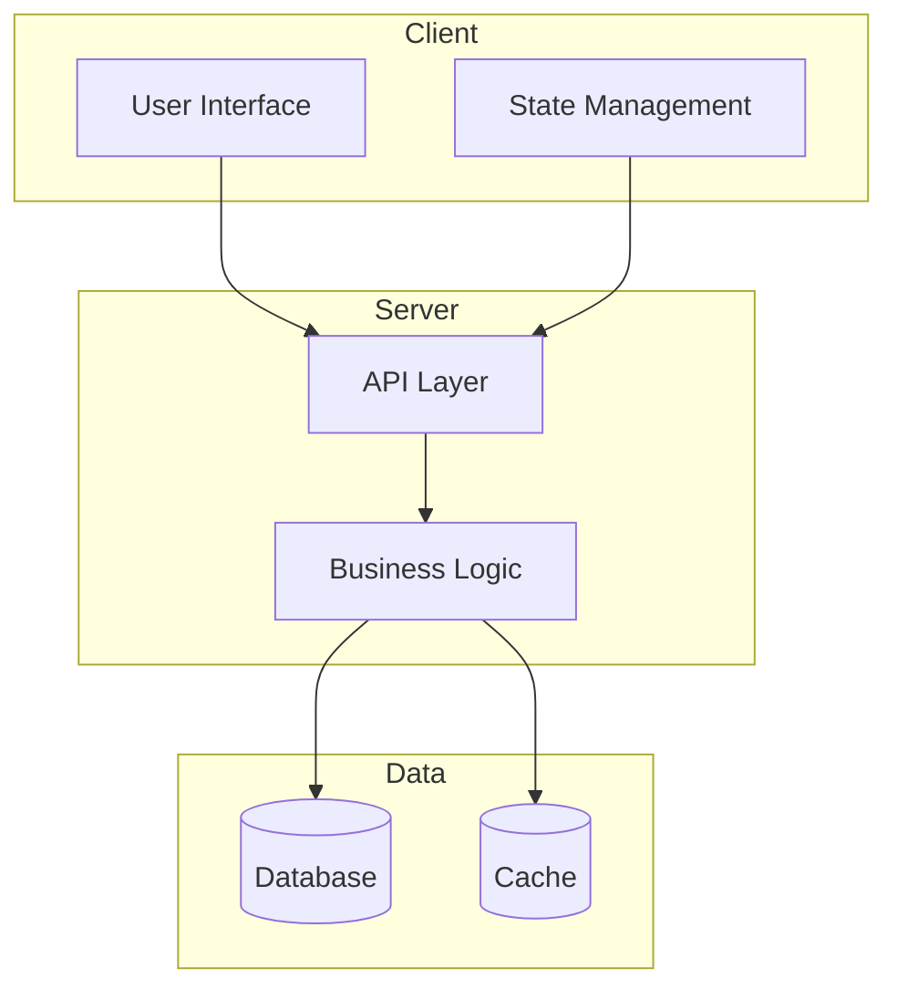

# Visual Documentation Guide

**Version**: 1.0.0
**Created**: 2025-08-21
**Last Updated**: 2025-08-21
**Status**: Active
**Target Audience**: Technical Writers, Developers, AI Assistants

**Enhancing documentation with visual elements for better comprehension**

## Overview

Visual documentation uses diagrams, progress bars, and flowcharts to make complex concepts immediately understandable. This guide covers two primary visual systems: Unicode progress bars and Mermaid diagrams.

## Visual Progress Bars

### Quick Reference
```
[██████████] 100% Complete ✅
[████████░░] 80% In Progress 🚧
[█████░░░░░] 50% Half Done
[███░░░░░░░] 30% Started
[░░░░░░░░░░] 0% Not Started ❌
```

### Creating Progress Bars

1. **Choose Width**: Standard is 10 blocks
2. **Calculate Fill**: `filled = Math.round((percentage / 100) × width)`
3. **Use Unicode**: `█` for filled, `░` for empty
4. **Add Context**: Include percentage and status emoji

### Example Implementation
```javascript
function progressBar(percent) {
  const filled = Math.round(percent / 10);
  const empty = 10 - filled;
  return '[' + '█'.repeat(filled) + '░'.repeat(empty) + ']';
}

// Usage
console.log(progressBar(75)); // [███████░░░]
```

## Mermaid Diagrams

### Supported Diagram Types

#### 1. Flowcharts


#### 2. Sequence Diagrams


#### 3. State Diagrams


#### 4. Entity Relationships


#### 5. System Architecture


### Mermaid Best Practices

1. **Keep Simple**: Don't overcrowd diagrams
2. **Use Subgraphs**: Group related elements
3. **Label Clearly**: Descriptive node labels
4. **Test Rendering**: Verify in GitHub preview
5. **Version Control**: Include diagram source with documentation

## When to Use Visual Documentation

### Use Progress Bars For:
- Feature completion status
- Implementation progress
- Test coverage metrics
- Sprint progress tracking
- Build and deployment status

### Use Flowcharts For:
- Decision trees and logic flows
- Process workflows
- User journey mapping
- API request flows
- Error handling paths

### Use Sequence Diagrams For:
- Authentication flows
- API interactions
- Multi-step processes
- System integrations
- Event sequences

### Use State Diagrams For:
- Object lifecycles
- Session states
- Application states
- User workflow states
- Connection states

### Use ER Diagrams For:
- Database schemas
- Data relationships
- System architecture
- Component dependencies

## Integration Examples

### In Feature Documentation
```markdown
## Implementation Status

### Visual Progress
```
Authentication      [██████████] 100% Complete ✅
Database Schema     [██████████] 100% Complete ✅
API Endpoints       [████████░░] 80% In Progress 🚧
UI Components       [██░░░░░░░░] 20% Started
━━━━━━━━━━━━━━━━━━━━━━━━━━━━━━━━━━━━━━━━━━━━━━
Overall Progress    [███████░░░] 75% 
```
```

### In Architecture Docs
```markdown
## System Flow


```

### In Status Reports
```markdown
## Sprint Progress

### Team Velocity
```
Week 1    [██████████] 32 points ✅
Week 2    [████████░░] 28 points 🚧
Week 3    [░░░░░░░░░░] 0 points (planned)
━━━━━━━━━━━━━━━━━━━━━━━━━━━━━━━━━━━━━━
Sprint    [██████░░░░] 60 points / 100 points
```
```

## Tools and Resources

### Creating Diagrams
- **Mermaid Live Editor**: https://mermaid.live/
- **Draw.io**: For complex diagrams
- **Excalidraw**: For hand-drawn style diagrams

### Unicode Characters
- `█` Full block (U+2588)
- `░` Light shade (U+2591)
- `▓` Medium shade (U+2593)
- `▒` Dark shade (U+2592)
- `━` Horizontal line (U+2501)

### VS Code Extensions
- **Markdown Preview Mermaid Support**
- **Mermaid Markdown Syntax Highlighting**
- **Unicode Character Insert**

## Quick Templates

### Status Dashboard Template
```markdown
### Visual Progress
```
Component A         [██████████] 100% Complete ✅
Component B         [████████░░] 80% In Progress 🚧
Component C         [░░░░░░░░░░] 0% Not Started ❌
━━━━━━━━━━━━━━━━━━━━━━━━━━━━━━━━━━━━━━━━━━━━━━
Overall             [██████░░░░] 60%
```
```

### Decision Flow Template
```markdown

```

### API Flow Template
```markdown

```

### Architecture Overview Template
```markdown

```

## Accessibility Considerations

1. **Alt Text**: Provide text descriptions for complex diagrams
2. **Color Independence**: Don't rely solely on color for meaning
3. **Screen Readers**: Include text summaries alongside visuals
4. **Fallbacks**: Provide text alternatives for all visual elements

## Maintenance

### Keeping Visuals Updated
1. Update progress bars with each milestone
2. Revise diagrams when architecture changes
3. Verify Mermaid syntax after updates
4. Test rendering in target platforms (GitHub, VS Code, etc.)

### Version Control
- Commit diagram source with documentation
- Track changes to visual elements in git history
- Document why diagrams changed in commit messages
- Include before/after comparisons for major diagram updates

## Integration with Project Workflow

### During Development
- Update progress bars as features are completed
- Modify flowcharts when business logic changes
- Update sequence diagrams when API contracts change
- Revise architecture diagrams when system design evolves

### During Reviews
- Use visual elements to explain complex changes
- Include diagrams in pull request descriptions
- Update status visuals before sprint reviews
- Create comparison diagrams for architecture decisions

### For AI Assistants

When creating or updating documentation:
- Always include appropriate visual elements
- Use progress bars for status updates
- Create flowcharts for complex decision logic
- Include sequence diagrams for multi-step processes
- Update existing visuals when making changes

## See Also

- [Documentation Standards](documentation-standards.md) - Overall documentation guidelines
- [Architecture Documentation](architecture.md) - System architecture patterns
- [Status Management](../STATUS.md) - Project status tracking